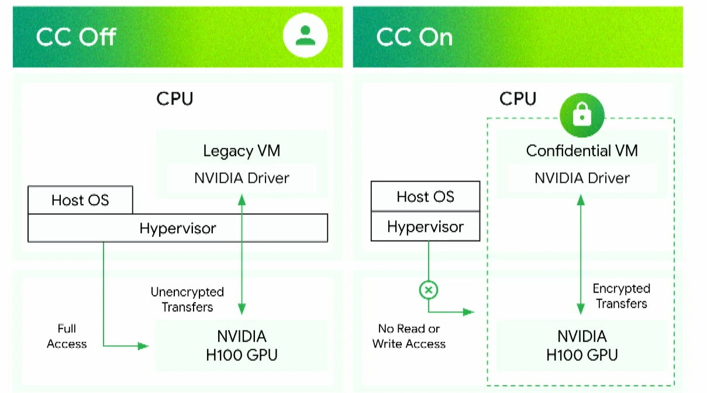

# Cloud Security Summary:

## Table of contents
1. [Homomorphic Encryption](#homomorphic-encryption)
2. [Confidential Computing](#confidential-computing)
	1. [Intel SGX and TDX](#intel-sgx-and-tdx) 
	2. [Nvidia Confidential Computing](#intel-sgx-and-tdx) 

## Homomorphic Encryption
Homomorphic Encryption Refers to the conversion of Data into ciphertext(encrypted text) which can still be processed and worked with by models as if the data was in its original form,meaning complex mathematical operations can be performed on encrypted data without compromising the encryption.

Homomorphic encryption is designed to create an encryption algorithm that enables an infinite number of additions to encrypted data.  

#### Types of homomorphic encryption:

- **Additively Homomorphic:** meaning adding two ciphertexts should equal the encryption of their plaintext sum.   
 ex:
$HE(A)+HE(B)=HE(A+B)$
- **Multiplicatively Homomorphic:** meaning the ciphertext is equal to the plaintext raised to the power of the key:  
$HE(A)=A^{encryptionKey}$  
$ HE(A) \cdot HE(B)=A^{encryptionKey} \cdot B^{encryptionKey} = (A\cdot B)^{encryptionKey}= HE(A\cdot B)$

Homomorphic encryption can be either additive or multiplicative, while also being partially, somewhat or fully homomorphically encrypted:  

- **Partially Homomorphic Encryption:** A defined operation can be performed infinite times on the ciphertext. These encryption schemes are relatively easy to design.

- **Somewhat Homomorphic Encryption:** A limited number of addition or multiplication operations are allowed, as opposed to an infinite number of one operation. It's more difficult to design a homomorphic encryption system that supports a set number of operations than one operation infinite times.

- **Fully Homomorphic Encryption:** An infinite number of additions or multiplications for ciphertexts is enabled. Programs for any functionality can be run on encrypted inputs to produce an encrypted output.

### Homomorphic Encryption Uses Cases
Some use cases include:
- Healthcare: Secure Computation on sensitive medical data while perserving patient medical confidentiality
- Finance: Secure analysis of financial transaction.
- Cloud Computing: Secure outsourcing of computations to the cloud while maintaining data privacy	

Basically Homomorphic encryption is useful in areas where sensitive data is processed in a public or third party enviornment, also it is useful when multiple parties need to access and process data without sharing the information itself, one such example is facebook providing ecrypted user information to 3rd party ad providers that produce targeted ads based on that info.

### Challenges And Limitations
Homomorphic Encryption includes complex mathemtical operations which generate a lot of computational overhead compared to plaintext operations.  
This results in **decreased performance** and increased resource requirements.

Fully Homomorphic Encryptions,which support arbitrary computations on encrypted data, often have strict limitations on the types and complexity of operations that can be performed.  
This **Limited Functionality** can restrict the applicability of HE to specific use cases and hinder its adoption in practical applications.

Homomorphoc Encryptions schemes are **Vulnerable** to various cryptographic attacks, including chosen-ciphertext attacks, side-channel attacks, and lattice-based attacks.

In Fully Homomorphic Encryption schemes, repeated encryption and decryption operations can introduce noise into the encrypted data, leading to degradation of accuracy and reliability over time. Managing and mitigating **Homomorphic Noise** is a significant challenge in practical HE implementations.

### The Future of Homomorphic Encryption

Homomorphic encryption could be incredibly useful for data security; however, it's still too slow to have any practical use, as the ciphertexts need to be correctly added or multiplied an infinite number of times. Fully homomorphic encryption is upward of 1 million times slower than equivalent operations in plaintext.  

Further standardization of homomorphic encryption could aid in creating a consistency in methods and help simplify the process. However, homomorphic encryption may never realize its full potential due to its inefficiency, and it is being replaced by newer alternatives.

## Confidential Computing

Confidential Computing refers to to a set of technologies and practicies that ensure data confidentiality and integrity. particularly during data processing.  

### The Problem
Data has 3 states it can exist in:  

1. **Stored(At Rest)**
2. **In Transit**
3. **Processing(At Use)**

There are many existing solutions for both data at rest (AES,RSA) and data at transit (TLS).  
Currently traditional methods of execution are vulnerable to core dumps since the memory is stored in plaintext.  
This basically allows an intruder to access sensitive information of a running application provided he has access to the machine either physically or through jailbreaking/compromising the machine

### A Solution
To combat data exifltration attempts while in use by an application we can use confidential computing capabilities, it refers to the use of hardware-isolated compartments within the processor that in not accessible to either the Host OS or a hypervisor(if present).

#### Enclaves
Enclaves are hardware encrypted enviornments and are an implementation of a **TEE** or **T**rusted **E**xectuion **E**nvironment, What this means is that they are completely isolated from the hypervisor and the os.  
The memory cannot be accessed by anyone outside of the vm application, even if it accesses it the memory is encrypted by a key only the cpu has access to.  

  

    
  

**Measurements:** These detail the enclave's environment and typically include the enclave identity, hadware platform details, configuration settings etc.

- **TPM(Trusted Platform Module):** A hardware component that stores cryptographic keys which are used for signing and verifying the integrity of the boot components

#### Secure Boot
Secure Boot refers to a standard implemented by modern firmware that ensures the device uses only the software trusted by the manufacturer.  

It protects against unauthorized code execution during the boot process and makes sure the os/kernel/drivers/os components that are loaded have not be tampered with.

- **UEFI:** a modern firmware interface that initializes hardware during the boot process, it loads the OS and replaces the traditional BIOS

- **TPM(Trusted Platform Module):** A hardware component that stores cryptographic keys which are used for signing and verifying the integrity of the boot components

The steps are as follows:  

1. **Power-On:** The device is powered on and the firmware (usually UEFI) starts the boot process.

2. **Signature Verification:** the firmware checks the signature of the bootloader to see if it has been tampered with, it is checked against signatures stored in the firmware itself (NOT THE TPM).  

3. **Chain Of Trust:** the bootloader loads the operating system kernel and verifies its integrity,then every other component such as drivers,os components is loaded and verified by the previous one.  
4. **Measurement And Storage:** once every component is loaded its hash is computed and stored in the tpm, which allows the system to verify the integrity of the boot process over time

**If any of the signatures dont match or verification fails the boot process is halted to prevent malicious code from running**

#### Types Of Confidential Computing
Confidential computing can work in two layers to provide isolation.
Either the Application Layer with solutions like intel SGX or VM Layer with Intel TDX and AMD SEV-SNP 

Most commonly used are Intel TDX and AMD SEV-SNP (at time of writing), AMD SEV-SNP does provide better protection against certain attacks such as memory remapping and replay attacks
#### Attestation

TEEs can provide Proof or **Attestation** that the code and data inside the enclave is secure and is running in the configuration expected by the user, this allows for trust in the cloud provider by the customer.

**Quote Generation Service (QGS):** A special software component that runs within the enclave and is responsible for generating attestation evidence (quote).

**Platform Certification Authority (PCA):** A trusted entity that vouches for the integrity of the hardware platform and the enclave creation process. Often, the CPU manufacturer (e.g., Intel) acts as the PCA.

The steps of attestation are:

1. A private-public keypair is generated when the enclave is created. these keys are generated based on whats called an Endorsment Key or EK and is specific to the processor used, it is stored on the hardware.
2. The enclave sends the public attestation key along with the measurements to a PCA encrypted using the private key.
3. The PCA verifies the integrity of the measurements using its knowledge of the EK registered that checks if the measurements report was really generated by a valid CPU that has not been revoked or tampered with.
4. Once The PCA verifies the TEE configuration it signs the report using its private key.
5. The signed report is sent back to the enclave and forwarded to the user which verifies the signature against the PCA public key and checks if there measurements are the expected values

#### Secure Collaboration
Secure Collaboration means supplying your data to a mutually agreed code with another party to compute something based on both data inputs

#### Supply Chain
Assured Open Source Software: Checks that the packages used are safe, mitigating supply chains attacks

### GPUS

  

    
  

in h100 the nvidia driver is part of the enclave and communication between cpu and gpu is encrypted,
not fully supported on all regions and all services have to check

### AI
Vulnerable to prompt injections to extract information from LLM based on their train data

LLM Engines are ran in a different region than the endpoint but since it is stateless 
no data is saved on the inference input

security controls:

- CMEK(Customer Managed Encryption Keys): when tuning the foundation model it is loaded to the region google managed service
and is trained on the finetuning-data generating a user encrypted adapter layer(last layer of FM) and is sent 
in inference time to the Foundation Model Service in a different Region

- DRZ:

### Challenges And Limitations

**Performance Overhead:** Implementing confidential computing solutions, particularly those based on hardware-enforced security mechanisms like Trusted Execution Environments (TEEs), can introduce performance overhead due to encryption, decryption, and secure enclave management. This overhead can impact application performance and scalability, especially for compute-intensive workloads.

**Security Risks:** While confidential computing solutions aim to enhance data security and privacy, they also introduce new security risks and attack vectors. Threats such as side-channel attacks, enclave vulnerabilities, and malicious insiders pose significant risks to the confidentiality and integrity of sensitive data processed within secure enclaves. 

<scripts>
<html><head>
	

</head></html>
</scripts>