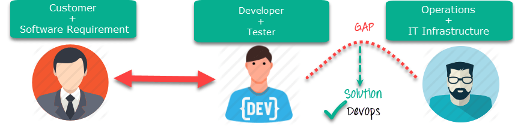
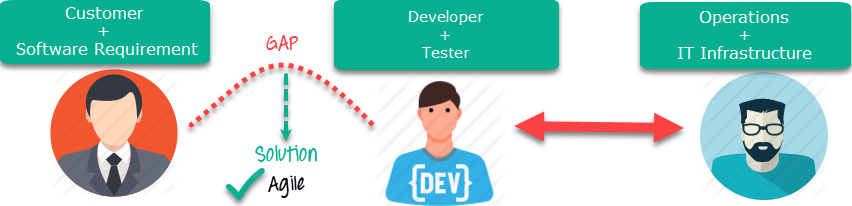
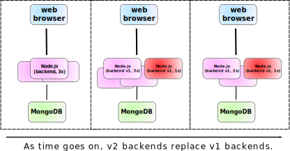
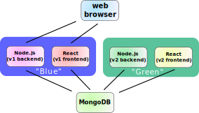
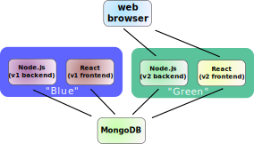
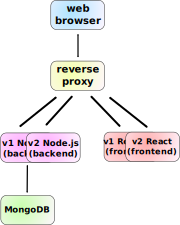
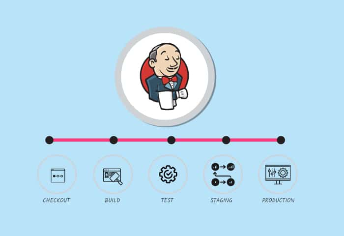

# DevOps Summary

## Table Of Contents
- [What Is DevOps?](#what-is-devops)
  1. [Agile Development](#agile-development)
- [Test Driven Development](#test-driven-development)
-  [Version Control](#version-control)
  1. [Pull Request Automation](#pull-request-automation) 
  2. [Git](#git)
- [Infrastructure As Code](#infrastructure-as-code)
  1. [Terraform](#terraform)
- [CI/CD](#cicd)
  1. [Continuous Integration](#continuous-integration)
    - [Code Coverage](#code-coverage)
    - [Linting](#linting)
    - [Ephemeral Enviornments](#ephemeral-enviornments)
  2. [Continuous Deployment](#continuous-deployment)
    - [Deployment Strategies](#deployment-strategies)
    - [Deployment Automation](#deployment-automation)
    - [Service Discovery](#service-discovery)
  3. [Jenkins](#jenkins) 
- [Microservices](#microservices)
  1. [Considerations Of Microservices](#considerations-of-microservices)
- [Monitoring](#monitoring)
  1. [Application Performance Management](#application-performance-management)


## What Is DevOps?
DevOps Is a methodology that helps engineering teams build products by continuously getting user feedback.


This approach allows you to continuously upgrade software instead of creating a new version of it every time.  
The steps of DevOps are:

1.  **Plan:** This stage involves understanding the product requirements, defining the architectural design, and planning how the application will be developed.
    
2.  **Code:** In this stage, developers write the code to implement the planned features and functionality of the application.
    
3.  **Build:** The code is built by compiling or transforming it into an executable format. This typically involves tasks such as compiling, packaging, and generating artifacts.
    
4.  **Test:** The application is tested to ensure its functionality, quality, and performance. This includes automated tests as part of continuous integration and manual testing by quality assurance teams.
    
5.  **Release:** Once the application passes the testing phase, it is prepared for deployment. This stage involves using continuous deployment strategies to deploy the new version of the application without disrupting the entire user base.
    
6.  **Deploy:** The new version of the application is deployed to the production environment, making it accessible to users.
    
7.  **Operate:** In this stage, the application is actively monitored, scaled, and managed in the production environment. This includes allocating resources, configuring the environment, and ensuring the application's availability and performance.
    
8.  **Monitoring:** Ongoing monitoring and feedback collection help gain insights into the application's performance, usage patterns, and user interactions. This information is valuable for making informed decisions and identifying areas for improvement.
    
9.  **Repeat:** The DevOps process is iterative and continuous. After deployment and operation, the cycle starts again with further planning, development, testing, and refinement.


### Agile Development
Agile and DevOps are closely related and often go hand in hand. Both Agile and DevOps are methodologies that aim to improve software development and delivery processes.

Agile refers to an iterative approach which focuses on collaboration, customer feedback, and small, rapid releases.  
While DevOps focuses on constant testing and delivery Agile focuses on delivering value to customers through frequent iterations and continuous improvement.





while DevOps aims to bridge the gap between Developers and Operation Teams,Agile aims to bridge the gap between the Developers and Customers.

Instead of following a linear project plan, Agile uses iterations or sprints to deliver working software in short, fixed time periods (e.g., 1-4 weeks). Each iteration includes planning, development, testing, and review activities.

## Test Driven Development
TDD is a coding methodology where tests are written before code is wr/itten.  
In TDD, the development process follows a cycle of writing a test, implementing the code to make the test pass, and then refactoring the code.  
The process of TDD is as follows:

1. **Create Test:** A developerwrites a test case that defines the desired behavior of the code.

2. **Run Test:** The developer runs the test, which should fail since the code is not implemented yet.

3. **Write Code:** The developer writes the minimum amount of code necessary to make the test pass.

4. **Run Test Again:** After implementing the code, the developer runs the test again to verify that it passes.

5. **Refactor Code:** Once the test passes, the developer refactors the code to improve its design, readability, and maintainability while keeping all the tests passing.

6. **Repeat:** The process is repeated for the next set of desired functionality or changes. Each cycle involves writing a test, implementing the code, running the test, and refactoring.


By following TDD, developers can ensure that their code is tested thoroughly and that it meets the desired requirements. 
### Test Types
**Unit Tests:** these ensure that all components work on their own
**Integration Tests:** these ensure multiple components work together
**End-To-End Tests:** these ensure the whole system works together (E2E,System Tests)
**Acceptance Tests:** these ensure the satisfaction of clients with the system

## Version Control
Version Control a.k.a Source Control is the practice of tracking changes to the code of an application,Source control systems such as git use special databases that keep track of every modification to the codebase,if a mistake is made rolling back the changes is as simple as running a few cli commands.  

Developers can clone the repository from the centeralized database systems like git provide, to their local machines, make changes to the code, and then commit those changes back to the repository.  

The source control system keeps track of each commit, including the specific changes made, who made them, and when they were made.

Branching allows developers to create separate lines of development, known as branches. This allows for the isolation of new features, bug fixes, or experiments without affecting the main codebase. Merging combines the changes from one branch into another, integrating the separate lines of development.

### Pull Request Automation
this refers to the automation of processes and tasks associated with managing pull requests in software development workflows.  
It involves using technologies to automate and optimize the steps involved in creating, reviewing, and merging pull requests.  

>Basically this means letting the developers know as soon as possible wether or not their change to the code is good or bad

The pull request is reviewed by at least one programmer in a code review where the programmer will check if the new changes comply with the code style,wether or not there are architectural problems etc. .
>These cannot be automated

After the coding review is done a product manager in charge of the functionality being proposed will give feedback.

The goal of this process is for a developer to be able to propose a change and get that change merged into the source code in the shortest time possible while maintaining correct code.

### Git
Git is a Distributed Version Control System (DVCS) and it is the most popular Source Control tool used as of writing this.  
Git provides a way to track changes, collaborate with others, and maintain a complete history of code modifications.  

**Repositories** are used to store the code of an application,those can be on the local machine or stored remotely on a Git Hosting Service such as GitHub or GitLab

**Branches** allow to separate lines of development and give developers the ability to work on different features,bug fixing and experiments without affecting eachother or the main codebase.

**Commits** are objects that describe the code at a specific point in time,they include a commit message which indicates the latest changes made since the last commit

**Pull Requests** are used to perform changes to a codebase and include one or more commits,they allow for review of the code changes before merging them into the main application code.

**Merge Conflicts** happen when multiple developers make conflicting changes to the same code, Git helps identify and resolve conflicts. Conflicts occur when Git cannot automatically merge changes due to overlapping modifications. Developers can review the conflicting sections, manually resolve the conflicts, and commit the resolved changes.


## Infrastructure As Code
Infrastructure As Code refers to putting all of the different components needed to deploy your software to a cloud enviornment into code.  
This can mean VMs,Containers,Storage,Network Configuration and more!.  

It also includes the applications themselves and moving the application code into the different compute components needed through code.  
You can think about IaC as automating your IaaS management.

There are multiple formats in which you can write IaC, Those include **JSON**, **YAML** or **XML**,they can also be **DSL**(Domain Specific Language)  specific to the tool youre using.  

Finally you can use a programming language such as python to define an infrastructure configuration,allowing for additional capabilities such as loops,conditionals,classes packages and more.  

There are a few different IaC services that allow you to use popular programming languages to setup IaaS,one such service is called Terraform.

### Terraform
Terraform is an open-source infrastructure-as-code software tool and it allows developers to define and provision infrastructure resources in the cloud, such as virtual machines, storage, networks, and more, using a declarative configuration language.

Instead of using the graphical user interface and going through the process manually,terraform provides a way to do so in script written in HCL (Hashicorp Configuration Language) or  JSON.

To get started with Terraform you need to install the CLI on your local system,files with the .tf extension are used and at the top they contain a terraform block that has global settings,this is where you can define cloud providers.

Below that is the provider block which defines the necessary credentials to connect to that provider along with configuration

Below the provider block we define the Resource block which includes the resource type such as an aws EC2 instance and a name for the resource,inside the block we configure the resource itself,for example the machine type or the zone its deployed in etc.

After the tf file is fully written you use 
```batch 
# initialize the terraform project
terraform init
# Apply the changes inside the .tf file to the cloud
terraform apply 
```
after the changes are applied
```batch 
terraform show
```
can be used to view the current state of the infrastructure
A good thing about terraform is that it keep track of infrastructure changes and allows you to view history of changes along with the diff between apply operations.

use
```batch
terraform destroy
```
to tear down an existing terraform project and delete the configuration.

## CI/CD

### Continuous Integration
CI or Continuous integration refers to the ability of developers to continuously push small updates to a central repository frequently,then those changes are verified by an automatic software that runs tests to ensure no major issues are seen by the customers 

By practicing CI, development teams can catch integration issues early, identify bugs or conflicts, and ensure that the codebase remains in a functional and stable state.  
CI helps to minimize the risks associated with merging code changes from multiple developers and promotes collaboration, as developers regularly integrate their work, enabling faster feedback and reducing the time between code changes and their validation.

To Achieve CI developers often make use of a branch-based development process.  

First developers "copy" the current source code that is presented to the customers at that point in time into a new branch called the **Feature Branch**, they then make changes to the source code and work independently from other teams on the various components.  

Then,still on the feature branch theyll "push" the updates onto the repistory still not interacting with the main code,that repository will run the configured CI tests.  

Finally the developer working on the feature branch makes a pull request asking to merge their code into the main code repository with the CI tests attached.
#### Code Coverage
It is a metric that measures how much of the code is "covered" by the tests of the CI/CD process,it is used to assess how thorough the tests are and helps developers identify areas of the code that are not adequately tested.  
It helps prevent untested or poorly tested code from being promoted to production, reducing the risk of bugs and issues in the live environment.

Code Coverage is measures by the number of non-sntax lines executed by tests divided by the total number of non-syntax lines
$$Code Coverage= \frac{ExecutedNonSyntaxLines}{AllNonSyntaxLines}$$

**Branch coverage** measures the coverage of groups of lines by tests instead of all lines,meaning how many groups of code are measures,groups can be a body of an if statement or a function etc.
#### Linting
Linters are programs that scan the source code of an application and find problem automatically,these are a common feature of pull request automation.  
They reduce the developer workload by ensuring that "obvious" mistakes are caught and dont make it to production.  
for example:  
```javascript
var x="5"
function f(elements){console.log(elements)
let x=0;
while(x<100){
  console.log(x)}
}
```
this code has multiple issues:  

1. the `console.log` statement is directly after the function declarion
2. it defines `x` twice,locally and globally
3. `x` is not incremented in the while loop causing an infinite loop

a set of rules can be set such as "dont shadow variables"(defining `x` twice in different scopes),then a linter can use that rule to validate the code and notify the developer without the need for a manual review.  

additionally linter rules can contain code style rules such as using tabs instead of spaces or using camel cases for local variables etc.
#### Ephemeral Enviornments
Ephemeral Enviornments are temporary deployments that have self-contained versions of an application.  

Each ephemeral environment typically corresponds to a specific branch or feature in the version control system. 

This allows developers to work on different features or changes in parallel without interfering with each other. Ephemeral environments provide a dedicated space where developers can test their code changes in an environment that closely resembles the production environment, without affecting the main application or other ongoing development work.  

### Continuous Deployment
Deployment automation has multiple goals,in addition to optimizing deployment efficiency it also: Deploys a feature to a set of users before releasing it publicly, starting new versions of services without causing downtime and rolling back services to previous versions in case an issue occurs.
#### Deployment Strategies

##### Rolling Deployment:
This is a strategy of deployment to ensure no downtime,a single instance of the new version is created before shutting off a single instance of the old version until all instances are upgraded.


##### Blue/Green Deployments:
  This strategy uses two clusters of the application,one cluster contains the current version of the code and traffic is routed to it,then we push the changes to the idle cluster and once all changes are made traffic is routed to the second cluster,next time we need to apply changes the process is repeated in the opposite direction




---




**Rainbow Deployments:** an extension to blue/green deployments,when the application is a long running task like rendering or deep learning algorithms,in rainbow deployments the old version will only be shutdown when the long running tasks are done processing.  

**Canary Deployments:** a "canary deployment" would be to route around 5% of your users at random to the new cluster, and check that those users do not have negative feedback. If not, the rest of the users can also be switched over to the new cluster, and the cycle can repeat.

#### Deployment Automation
Autoscaling automates vertical **and** horizontal scaling of the application so that the number of workers and the resources for each worker are proportional to the load.
  
This is to ensure that when there are spikes in application load such as higher user traffic the application does not go down and it also helps in saving on costs,when the load is at its lowest fewer workers can be used.

**Serverless** is the extreme of auto-scaling,while autoscaling works in ~1 hour chunks of work,serverless usually refers to ~100 ms,this means that whenever there are no users accessing a web-server it does not have to run at all.  
Serverless works by defining resources that are quickly started and are spun up for specific requests,additonally serverless applications are usually stateless and do not retain specific configuration.

#### Service Discovery
Service Discovery refers to the process of automatically and dynamically discovering the network location and availability of services or components within a distributed system.   

Hard coding the ip addresses for different services makes CD difficult because whenever a new version needs to be deployed you would need to change the ip addresses to match the new version.  
To deal with this issue there are multiple approaches:  

**Reverse Proxy Servers:** in order to ensure zero downtime while still being able to dynamically change ip addresses of services that traffic is routed to, it is possible to use a reverse proxy server.  
This server functions as a gateway and re-routes traffic to the correct version of the application



However the Reverse Proxy Server still needs to find the IPs of the different versions in order to switch the traffic routing.  
This is done by either manually changing the configuration in a config file inside the reverse proxy server.  

Or it is possible to use an **internal DNS Server** that the reverse proxy server accesses in order to resolve the hostnames of each version,this way you only change the records of your dns server which can be automated in the deployment workflow.

### Jenkins

Jenkins is an automation server that offers a simple way to set up a continuous integration and continuous delivery environment for almost any combination of languages and source code repositories using **Pipelines**.  

in simple terms it provides a platform for automating the building, testing, and deployment of software projects.




With Jenkins, developers can define a series of steps or stages that make up their CI/CD pipeline. These steps can include tasks such as compiling code, running unit tests, packaging the application, and deploying it to various environments. Jenkins provides a user-friendly web interface and a powerful scripting language (Groovy) to define and configure these pipelines.

A **Jenkins Controller** is the main instance of jenkins and it is responsible for configuration,key management,plugins and it is a centeralized hub for managing to manage all of the agents connected to it.

**Agents** are typically machines,or containers that connect to a jenkins controller and execute tasks when directed by it,those tasks are the pipeline steps.


#### Plugins
**Plugins** are additional components that can be added to a Jenkins environment to expand its capabilities. There are thousands of plugins available, which can integrate with various tools and services.

These plugins enhance Jenkins by providing features such as integrating with build tools, cloud providers, analysis tools, and more. They can be easily installed through the Jenkins web interface. 

With plugins, users can customize their Jenkins setup to meet their specific needs and integrate with a wide range of tools and services.


A **Jenkins Pipeline** is a suite of plugins that supports implementing and integrating continuous delivery pipelines into Jenkins. Pipeline provides an extensible set of tools for modeling simple-to-complex delivery pipelines "as code" via the Pipeline DSL
#### Jenkinsfile
A Jenkinsfile is a file that exists at the root directory of the source control repository and it allows you to define the build, test, and deployment steps for your software delivery process.

A Jenkinsfile is primarily written in the Groovy programming language, which is the recommended and most commonly used language for writing Jenkinsfiles.  
Groovy provides a rich set of features and constructs that are specifically designed for building pipelines in Jenkins.  
For example:
```groovy
pipeline {
    agent any

    stages {
        stage('Build') {
            steps {
                echo 'Building..'
            }
        }
        stage('Test') {
            steps {
                echo 'Testing..'
            }
        }
        stage('Deploy') {
            steps {
                echo 'Deploying....'
            }
        }
    }
}
```


## Microservices
Microservices is an architecture that structures an application as a collection of small and modular independent services which have their own resources and are deployed separately.  

Microservices are designed to be loosely coupled and highly cohesive.  
meaning each service has its own defined purpose and communicates with other services through an interface that allows for maximal independence.

Each microservice can have its own technology stack, programming language, and database, depending on the specific requirements of the service.

This architecture allows for **separate development** of each service,which can boost development time,additionally these independence creates the option to **separately scale** service independently,since not all services require the same amount of resources.  

Loose coupling helps in isolating failures. If one microservice encounters an issue or becomes unavailable, it does not have a cascading effect on other services. This promotes fault isolation and improves the overall **resilience** of the system. 
### Considerations Of Microservices
Microservices may not always be the best approach,sometimes it is better to use a monolithic approach,meaning all of the services are hosted within the same host and communicate with each other through in-process communication mechanisms such as function calls or shared libraries. 

In a monolithic approach, all components of the application are tightly coupled and deployed as a single unit.

In cases where the project is relatively small and has straightforward requirements it would be simpler to develop it using a monolithic architecture,it can provide better performance since all of the communication happens within the same host and no network overheard is introduced.

Some experts argue that breaking down services into extremely fine-grained units, referred to as nano services, can lead to excessive complexity, increased overhead, and difficulty in managing the system. This level of granularity can make it challenging to maintain and orchestrate a large number of services effectively.

## Monitoring
### Application Performance Management

It ensures that metrics such as request processing time,number of servers used and other key health metrics are processed and if theres a problem the appropriate people responsible for the operation of the service are notified and can respond to it.  

It also includes logging of all events relating to a service allowing us to infer conclusions from them and improve upon them.  

If the metrics indicate theres an issue with the load amount on the servers it allows for them to automatically scale based on those metrics.
### Nagios
