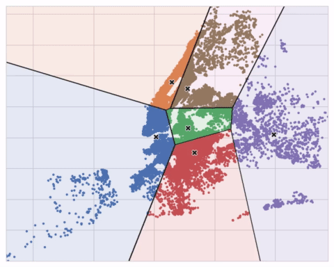

# Machine Learning Summary:

## Table of contents
- [Machine learning](#machine-learning)
	1. [What is machine learning?](#what-is-machine-learning)
	2. [Why do we need it?](#why-do-we-need-it)
	3. [Dangers and disadvantages](#dangers-and-disadvantages)
	4. [The steps of machine learning](#the-steps-of-machine-learning)
	5. [Choosing features](#choosing-features)
		- [Mutual information](#mutual-information)
		- [Clustering](#clustering)
		- [Principal Component Analysis (PCA)](#principal-component-analysis-pca)
	6. [Model Validation](#model-validation)
		- [Underfitting and Overfitting](#underfitting-and-overfitting)
		- [Cross Validation](#cross-validation)
	7. [Pre-Processing](#pre-processing)
		- [Missing values](#missing-values)
		- [Categorical values](#categorical-values)
		- [Pipelines](#pipelines)
	8. [Data Leakage](#data-leakage)
- [Deep learning](#deep-learning)
	1. [What is deep learning?](#what-is-deep-learning)
	2. [Why do we need it?](#why-do-we-need-it_1)
	3. [Linear unit](#the-linear-unit)
	4. [Activation function](#the-linear-unit)
	5. [How do neural networks learn?](#how-do-neural-networks-learn)
		- [Loss Function](#loss-function)
		- [Optimizer](#optimizer)
	5. [Other layers](#other-layers)
		- [Dropout](#dropout)
		- [Batch normalization](#batch-normalization)
	6. [Classification](#classification)
		- [Accuracy and cross entropy](#accuracy-and-cross-entropy)
		- [Sigmoid](#sigmoid-function)
	7. [convolutional neural networks](#convolutional-neural-networks)

## Machine learning

### What is machine learning? 
machine learning is a field involving the training of computers on some data,having it infer patterns from that data and using those patterns to solve problems with new data without being explicitely programmed to do so.
### Why do we need it?

machine learning has multiple advantages.

1. **Large amounts of data**, it helps with handling large amounts of data,since these days theres lots of data as a result of the information age,machine learning helps in finding patterns in the data humans may miss.

2. **Predictions**,machine learning can make prediction based on data it has been trained on and thus forecast important events such as stock prices and behavior of different things.

3. **Automation**,it can automate time consuming tasks such as classification of images,speech recognition and tasks such as customer support can be automated as well

4. **personalization of data**,machine learning can be used to personalize data such as search engines results and social media to cater to specific individuals

5. **complex-problem solving**,it can be used to solve problems too complex for humans to explicitely program that may not have well defined rules or algorithms,video analysis and autonomous vehicles are examples of those.

6. **adaptability**,machine learning models are able to continously learn and adapt to new patters allowing them to work in dynamic enviornments where trends and patters could change,an example of that is **natural language processing (NLP)** using transfer learning and fine-tuning NLP models are able to adapt and improve with new data.

overall machine learning is important because it offers ppowerful tools to ways to use big data to automate tasks,make accurate predicitions and improve innovation in different fields.

### Dangers and disadvantages

1. **Data-Dependency**,the machine learning models rely on the data to be accurate and not biased,or else they find biased patterns and give incorrect results.
2. **Overfitting**, if the machine learning model is too complex and specific/specialized to the training data,it will perform poorly on new unseen data,that is called memorizing the noise and the model loses its generalization.
3. **Lack of interpretability**, There are lots of machine learning models where it is hard to interpret the reason a decision was made by the model,models such as complex neural networks are treated as black boxes and are problematic when justification for the prediction is needed (for example health care and legal systems).
4. **Computational intensity**, complex models such as some nueral networks and deep learning models can require a significant amount of resources and computational power to use.

### The steps of machine learning

- assuming we have the dataset ready for use we first want to "clean" the data and make it useful,that is a part of what we call **pre-processing**.
there are many forms of preprocessing such as handling missing values (NaN) and Data normalization,it is an essential step for the model training process. 

- after we've pre-processed the data we then do what is called **fitting** or training the model based on the data we've pre-processed,generally it is a good idea to split our data into a training set and validation set so we can evaluate our model performance on a different set of data,this is to detect overfitting. 
basically fitting is the calculation and adjustment of the model's parameters to minimize the error between the predicted value and the actual value.

- now that we have our parameters we use them to **predict** a values based on new data it has never seen before(not part of the training data),the set is usually called the validation set

- we use our predicted values and compare them with the actual validation values to see the accuracy of the model on data it hasnt seen before,we calculate the difference between the real and predicted values to **evaluate** the model's performance.
this process helps with detection of overfitting and underfitting,these occure when we made a *bad* decision and trained the model incorrectly(or chose an incorrect model in the first place)

### Choosing Features 

Features are also called attributes or predictors and are the information a model receives for each data point,for example in a dataset of the salaries in tech companies the features a model may receive could be Age,Level of education and years of experience

Index | Age | Education | Experience_Years
 --- | --- | --- | ---
0 | 23 | Bachelor's degree | 3
1 | 19 | Highschool | 1
2 | 34 |  Masters degree | 9

There are many things to consider when choosing features and maybe even creating our own,we want our features to give us as much information as they can about the target without causing overfitting or having too large of a dimensionality.
we use techniques such as MI(mutual information) and PCA to determine the relevance of features to our target
we also want our features to be as indepndent from eachother as possible while still giving us as much information as possible,high correlation among features is redundant and will decrease model performance by increasing model complexity.

#### Mutual information
Mutual information is a function measuring associations between a feature and the target,it is also called a **feature utility metric** ,it is similar to correlation in that it measures a relationship between two quantities. The advantage of mutual information is that it can detect *any* kind of relationship, while correlation only detects *linear* relationships.  
Mutual information is a great general-purpose metric and especially useful at the start of feature development when you might not know what model you'd like to use yet. It is:

- easy to use and interpret,
- computationally efficient,
- theoretically well-founded,
- resistant to overfitting, and,
able to detect any kind of relationship

Mutual information describes relationships in terms of uncertainty. The mutual information (MI) between two quantities is a measure of the extent to which knowledge of one quantity reduces uncertainty about the other. If you knew the value of a feature, how much more confident would you be about the target?

	(Technical note: What we're calling uncertainty is measured using a quantity from information theory known as "entropy".  
	The entropy of a variable means roughly: "how many yes-or-no questions you would need to describe an occurance of that variable, on average."  
	The more questions you have to ask, the more uncertain you must be about the variable.  
	Mutual information is how many questions you expect the feature to answer about the target.)
for example in a dataset describing salaries we expect a feature called level_of_education to have a high MI score as the level of education usually separates different positions with different salaries allowing us to make more accurate assumptions using that information  
>**however it is important to remember that it's possible for a feature to be very informative when interacting with other features, but not so informative all alone. MI can't detect interactions between features. It is a univariate metric and therefore may not detect all informative features**.

#### Clustering
Clustering is the assignment of data points to groups based on how similar they are to each other,this is useful to help machine learning models untangle complicate relationships between features.
Clustering is an unsupervised learning method meaning it does not rely on the target but on the features of every data point.
The goal of clustering is to identify patterns or relationships within the data,
discovering hidden structures in a way that maximizes the similarity inside a cluster and minimize similiarities between clusters.

The motivating idea for adding cluster labels is that the clusters will break up complicated relationships across features into simpler chunks. Our model can then just learn the simpler chunks one-by-one instead having to learn the complicated whole all at once. It's a "divide and conquer" strategy.

The figure shows how clustering can improve a simple linear model. The curved relationship between the `YearBuilt` and `SalePrice` is too complicated for this kind of model *it underfits* . On smaller chunks however the relationship is almost linear, and that the model can learn easily.

##### Considerations when using Clustering
- There needs to be clear patters or groupings in the data,if the data is full of noise or lacks inherent structure,clustering may not provide meaningful results
- Small data or non diverse data may not provide meaningful results when clustering,clustering requires sufficent data to uncover meaningful structures
- Domain knowledge or expert insights can help determine if clustering is appropriate for a particular problem. If there are predefined categories or labels that can be used, supervised learning methods may be more suitable.
-  Clustering algorithms often produce results that require interpretation and understanding. If the goal is to explain the findings or communicate the results to stakeholders, ensure that the clustering approach provides interpretable and meaningful clusters.

##### K-Means
K-Means clustering is a clustering algorithm that measures similarity between points using the distance between each point based on its features (straight-line distance)
it creates the clusters using the placement of a number of points called **centroids** inside of the feature space,each point in the data set is assigned to the closest centroid to it based on distance,there are k centroids which is a hyper parameter you decide on.
the algorithm is as follows

1. Place k centroids randomly on the feature-space

2. Measure the distance of every point to the centroid

3. Assign points to the closest centroid based on that distance

4. Move the centroid of each group to the **Center Of Mass** of that group,meaning the 
mean of all the points in the group

5. Repeat steps 2-4 until all centroids stops moving more than some small ε distance or until a max-iteration parameter is reached 

usually the entire process is repeated multiple times because the centroids are initally place randomly across the feature space and the inital position may not be optimal,there could be a placement of centroids that provides a better separation into groups

#### Principal Component Analysis (PCA)
PCA is an un-supervised learning technique,the goal of PCA is to find a lower dimensional representation of the data while capturing a maximum amount of variance,meaning we want to use as little features as possible while still having those features offer us as much information as possible about the differences between each data point. 

PCA generates a table of **loadings** which describe the combination of features for each component we create using the PCA algorithm,for example if we have a data set:

Index | Age | Education | Experience_Years
 --- | --- | --- | ---
0 | 23 | Bachelor's degree | 3
1 | 19 | Highschool | 1
2 | 34 |  Masters degree | 9

and we apply pca to it,a loadings table may look like this 

Index | PC1 
 --- | ---
Age | -0.2
Education(Encoded) | 0.4 
Experience_Years | 0.5

the question is **What does PC1 describe**?

well from the table we can infer `PC1=-0.2*Age+0.4*Education(Encoded)+0.5*Experience_Years`
we can see that PC1 gives us a contrast between young people with lots of experience and a high level of education and older people with a lower amount of experience and education
which makes sense as those two groups are usually extremes of the dataset,it gives us the largest variance while minimizing the amount of features,therefore reducing dimensionability and complexity

there are two main ways to use PCA for feature engineering:

1. the first way is to use it a descriptive technique,after creating the components you could calculate the MI scores for the components to see which variation is most predictive of the target.
you could then check the loadings for the components with the top MI scores and check which features have the most influence on that principal component.
for example adding a feature of the ratio between experience years and age.

2. The second way is to use the components themselves as features. Because the components expose the variational structure of the data directly, they can often be more informative than the original features.

##### Use cases

- **Dimensionality reduction**: When your features are highly redundant (multicollinear, specifically), PCA will partition out the redundancy into one or more near-zero variance components, which you can then drop since they will contain little or no information.
- **Anomaly detection**: Unusual variation, not apparent from the original features, will often show up in the low-variance components. These components could be highly informative in an anomaly or outlier detection task.
- **Noise reduction**: A collection of sensor readings will often share some common background noise. PCA can sometimes collect the (informative) signal into a smaller number of features while leaving the noise alone, thus boosting the signal-to-noise ratio.
- **Decorrelation**: Some ML algorithms struggle with highly-correlated features. PCA transforms correlated features into uncorrelated components, which could be easier for your algorithm to work with.

##### Considerations when using PCA

- PCA only works with numeric features, like continuous quantities or counts.
- PCA is sensitive to scale. It's good practice to standardize your data before applying PCA, unless you know you have good reason not to.
- Consider removing or constraining outliers, since they can have an undue influence on the results. 
### Model validation

Usually when we create machine learning models we would like to evaluate them based on accuracy,that way we know wether our model is suitable for production and if there are any problems we could fix.
to do that we first split our data into the training data and then the validation data,if we evaluate the model based on the same data it was trained with it will give us a misleading result for our accuracy,the patterns it may have detected for our training set may not be correct for new data it will receive in production.
after fitting the model on the training data we calculate the prediction values based on the features of the validation data.
we then compare those predictions to the real values of the validation set,we calculate something we call the **LOSS function**,basically the further away our prediction is from the correct value the bigger the loss function result is.
there are many ways to calculate loss and each has their own purpose,for example **MAE(Mean Absolute Error)** is calculated by `|Prediction-True|`

#### Underfitting and Overfitting
- **Underfitting** occurs when the model has failed to learn patterns and relationships in the training data,that can occur as a result of many things such as insufficient training or an oversimplifed model not fit to solve the problem,we call this not learning enough *signal*.
- **Overfitting** occurs when the model has learned too much *noise* and not enough *signal* meaning it has a high accuracy on the training set but a significantly lower one on the validation set,this happens when the model too closely fits the training data and loses its generalization,the model is too complex,you can think of it as the model "memorizing" the training dataset.
#### Cross validation
In model validation we split our data into two types of sets,a training set and a validation set,for an example lets say the split is 80-20 where 80% of the data is training data and 20% is validation data
it is possible that the 20% of validation data we chose could perform accurately while a different 20% of the data would have performed worse,this problem is more likely when the dataset is relatively small since the larger the dataset is the more data we can use for validation making the validation score more reliable.  
to solve this issue we could use a method called Cross-Validation.
In cross validation we split our data into multiple subsets(folds),and then evaluating the model mulitple times,each time with a different subset while using the rest of the subsets as training data. 

for example if we choose to split our data into 5 folds:
first we use the first fold as validation data and folds 2-5 as training,we calculate the loss for that iteration.  
then we choose the second fold as validation data and the rest of the folds as training,we calculate the loss again and keep doing that until weve used all folds as validation data once  
we then calculate the mean of the loss results to get the most accurate loss.
this gives us a better estimation of our model's accuracy.

Cross-validation gives a more accurate measure of model quality, which is especially important if you are making a lot of modeling decisions. However, it can take longer to run, because it estimates multiple models (one for each fold).

So, given these tradeoffs, when should you use each approach?

- For small datasets, where extra computational burden isn't a big deal, you should run cross-validation.
- For larger datasets, a single validation set is sufficient. Your code will run faster, and you may have enough data that there's little need to re-use some of it for holdout.

There's no simple threshold for what constitutes a large vs. small dataset. But if your model takes a couple minutes or less to run, it's probably worth switching to cross-validation.

### Pre-Processing

we will often need to pre-process our data to make it fit for usage with our model,we use pre-processing to handle missing values and encoding of categorical features as well as many other transformations of our data.

#### Missing values
missing values occur when data wasnt collected for a certain feature for a data entry,this makes sense as not every data entry should have every feature populated,for example in a dataset of house prices,some houses will have a value for a feature called basement_size and some won't,since not every house contains a basement.  

- There are multiple strategies when it comes to handling missing values
The simplest option is to just ignore every column in the dataset that contains any missing values

- another option is to use imputation.  
Imputation fills in the missing values with some number. For instance, we can fill in the mean value along each column.

The imputed value won't be exactly right in most cases, but it usually leads to more accurate models than you would get from dropping the column entirely.

- the third option is an extension to imputation.  
rows with missing values may be unique in some other way. In that case, your model would make better predictions by considering which values were originally missing.

In this approach, we impute the missing values, as before. And, additionally, for each column with missing entries in the original dataset, we add a new column that shows the location of the imputed entries.

#### Categorical values
A categorical variable is a variable that takes a limited number of values,it can be a car's brand or a product's physical condition  
we have many ways of handling categorical values

- The easiest approach to dealing with categorical variables is to simply remove them from the dataset. This approach will only work well if the columns did not contain useful information.

- **ordinal** encoding is an approach that assigns an integar for every unique value of the categorical value,for example:

This approach assumes an ordering of the categories: "Never" (0) < "Rarely" (1) < "Most days" (2) < "Every day" (3).  
This assumption makes sense in this example, because there is an indisputable ranking to the categories. Not all categorical variables have a clear ordering in the values, but we refer to those that do as ordinal variables. For tree-based models (like decision trees and random forests), you can expect ordinal encoding to work well with ordinal variables.

- **One-hot encoding** creates new columns indicating the presence (or absence) of each possible value in the original data. To understand this, we'll work through an example.

In the original dataset, "Color" is a categorical variable with three categories: "Red", "Yellow", and "Green". The corresponding one-hot encoding contains one column for each possible value, and one row for each row in the original dataset. Wherever the original value was "Red", we put a 1 in the "Red" column; if the original value was "Yellow", we put a 1 in the "Yellow" column, and so on.  
In contrast to ordinal encoding, one-hot encoding does not assume an ordering of the categories. Thus, you can expect this approach to work particularly well if there is no clear ordering in the categorical data (e.g., "Red" is neither more nor less than "Yellow"). We refer to categorical variables without an intrinsic ranking as nominal variables.  
One-hot encoding generally does not perform well if the categorical variable takes on a large number of values (i.e., you generally won't use it for variables taking more than 15 different values).
- A **Target encoding** is any kind of encoding that replaces a feature's categories with some number derived from the target.  
for example,in a dataset containing information about a car and its price as the target,we could encode the make of the car to be the average target price of cars with that make

	Index | make | price | make_encoded
	 --- | --- | --- | ---
	0 | alfa-romero |  13495 | 15498.333333
	1 | alfa-romero |  16500 | 15498.333333
	2 | alfa-romero |  16500 | 15498.333333
	3 | audi | 13950 | 17859.166667
	4 | audi | 17450 | 17859.166667
	5 | audi | 15250 | 17859.166667
	6 | audi | 17710 | 17859.166667
	7 | audi | 18920 | 17859.166667
	8 | audi | 23875 | 17859.166667
	9 | bmw | 16430 | 26118.750000

		This kind of target encoding is sometimes called a mean encoding.  
		Applied to a binary target, it's also called bin counting.  
		(Other names you might come across include: likelihood encoding, impact encoding, and leave-one-out encoding.)
	There are a few problems with target encoding to be aware of:  
	1. first is rare categories,categories with only a few or even one entry will have a very biased value for the target encoded feature.  
	2. second is using the training data to encode,this is a problem because it uses the target variable during training and it may overfit and struggle to generalize to new unseen data,usually its better to have a separate split for target encoding on which you calculate the values and then populate them in the other splits.  
	3. a third issue is unknown categories,you would have to impute those encoded values somehow  

	A solution to the first problem is to add smoothing. The idea is to blend the in-category average with the overall average. Rare categories get less weight on their category average, while missing categories just get the overall average.
	`encoding = weight * in_category + (1 - weight) * overall`
	
	where weight is a value between 0 and 1 calculated from the category frequency.  
	An easy way to determine the value for weight is to compute an m-estimate:  
	`weight = n / (n + m)`

##### Use cases

- **Ordinal Encoding** - when there is a clear hierarchy between categories and high cardinality ex: level of education
- **One Hot Encoding** - when theres low cardinality of the variable and no ranking for the categories ex: car brand
- **Target Encoding** - when theres high cardinality of the variable and no ranking for the categories ex: country

#### Pipelines
Pipelines are a simple way to keep your data preprocessing and modeling code organized. Specifically, a pipeline bundles preprocessing and modeling steps so you can use the whole bundle as if it were a single step.
##### Benefits

- Cleaner Code: Accounting for data at each step of preprocessing can get messy. With a pipeline, you won't need to manually keep track of your training and validation data at each step.

- Fewer Bugs: There are fewer opportunities to misapply a step or forget a preprocessing step.

- Easier to Productionize: It can be surprisingly hard to transition a model from a prototype to something deployable at scale. We won't go into the many related concerns here, but pipelines can help.

- More Options for Model Validation: You will see an example in the next tutorial, which covers cross-validation.

With the pipeline, we supply the unprocessed features in validation set to the model, and the pipeline automatically preprocesses the features before generating predictions. (However, without a pipeline, we have to remember to preprocess the validation data before making predictions.)

In conclusion Pipelines are valuable for cleaning up machine learning code and avoiding errors, and are especially useful for workflows with sophisticated data preprocessing.

### Data Leakage
Data leakage (or leakage) happens when your training data contains information about the target, but similar data will not be available when the model is used for prediction. This leads to high performance on the training set (and possibly even the validation data), but the model will perform poorly in production.

In other words, leakage causes a model to look accurate until you start making decisions with the model, and then the model becomes very inaccurate.

There are two main types of leakage: target leakage and train-test contamination.

- Target leakage happens when the features you use to make predictions contain some data that is only available after the target is already available.
for example if we want to predict wether or not a person is ill based on some features,a predictor indicating if the person took medicine recently could cause target leakage,since people usually take medicine after they become ill,this could lead the model to think that anyone who hasn't taken medicine is in fact not ill,which is not necessarily the case,this will make the model perform well in both training and validation however it will fail in production

	Index | Age | Weight | Took_Medicine | Is_Sick
	 --- | --- | --- | --- | ---
	0 | 23 | 60 | True | True
	1 | 32 | 90 | False | False
	2 | 14 | 50 | True | True

- Train-Test Contamination happens when data from the test/validation set is incorporated into the training set,for example if we use imputation we may use the mean value of a feature across all data and by doing that we get the values influenced by the validation data,that way the model makes predictions closer to the validation data as well as the training data skewing the accuracy when in production it will be less accurate

## Deep learning

### What is deep learning? 
Deep learning is an approach to machine learning that focuses on training artificial neural networks to learn and make predictions or decisions directly from raw data. It is called "deep" learning because it involves training neural networks with many layers,aka Depth. This architecture allows them to learn complex patters in the data.

deep learning can be thought of as a way to teach computers to learn and make sense of information similar to how humans do. It involves building and training artificial neural networks that are made up of neurons interconnected with each neuron performing its own calculation of a value.

neural networks are usually built with 1 input layer,multiple hidden layers which are called hidden cause we never see their direct values,and an output layer containing some amount of outputs
### Why do we need it

- **Complex Data**: Deep learning is good when it comes to processing and extracting meaningful patterns from complex and high-dimensional data, for example images, audio, and text. Its ability to automatically learn hierarchical features and patterns makes it a great option for tasks where other machine learning techniques may struggle to capture the complex patterns of the data.
- **Less requirement for human interaction**: when it comes to other machine learning techniques there is often a need for human interaction when it comes to feature extraction,for example a model that recognizes stop signs in an image,a human may need to choose which features the algorithm should use,however in deep learning the algorithm is able to identify features by itself and automatically feature engineer by learning from its own errors.

### The linear unit
the simplest neural network is made of one neuron as the input and the result of some function as the output,in addition to that we also have something we call a **bias**,it does not have any input data associated with it and instead it has some weight that the network can modify to change the output independently from the input.
every neuron has its own weight its multiplied by before using its value in the next neuron its connected to,for example we can have the following:

in this example we have one input neuron **X** , one bias with the value 1 and one weight for each **w** , **b** respectively,we also have a function that adds all its inputs up and the result of that function is the output,essentially this neural network describes the function $y=wx+b$,which is the equation of a line.
this is called a linear unit.
a linear unit can have multiple inputs as well

the formula for this neural network would be 
$y=w_0x_0+w_1x_1+w_2x_2+b$

when we connect linear units together and give them a common set of input we get whats called a **Dense layer**,each layer in a neural network performs some kind of relatively simple transformation of the inputs and through a stack of those layers a neural network can transform its inputs in more complex ways.

### Activation function
Two dense layers with nothing in between are no better than a single dense layer by itself. Dense layers by themselves can never move us out of the world of lines and planes. as they are just linear combinations of the previous layer.
What we need is something nonlinear for our model to deal with more complex relationships.
To achieve that we use activation functions.  

An **activation function** is a function we apply to a layer's outputs(the activations),a common one is the rectifier function,when used with a linear unit we get a Rectified Linear Unit or *ReLU*.  
a rectifier is a function that returns the input its received if its greater than 0 and otherwise it returns 0,meaning it rectifies the negative part to 0

in this case $y=\max(wx+b,0)$

using layers with activiation functions such as this allows us to capture complex relationships in the data,sometimes we will also need activation functions to normalize and transform the data for other purposes,for example turn something into a probability for classification problems

### How do neural networks learn?
Just like any machine learning method we need a set of training data,training the neural network makes use of the features in the training data along with the expected target(the output).
when we train the neural network we adjust the weights of each neuron in a way that gets the predicted value as close as possible to the true target value.  
in addition to the training data we make use of two more things to achieve that:

- a **Loss Function**
- an **Optimizer**

#### Loss Function
after we've designed an architecture for the network we need to tell our network what problem it needs to solve.
for that we use the **Loss Function**  
the loss function measures how different our prediction is from the target's true value.
different problems often require different loss functions,
for example for regression tasks such as predicting the price of a house we often use the **MAE** function of Mean Absolute Error which is given by `Abs(y_true-y_pred)`
however for tasks like classification we would use a function such as **cross-entropy**
#### Optimizer
After the model knows what problem it needs to solve and how close it is to solving it,we need to tell it *how* to solve it.
for that we use the optimizer,the optimizer is algorithm that tells the model how it needs to modify its weights in order to make the loss smaller.  
Virtually all of the optimization algorithms used in deep learning belong to a family called stochastic gradient descent. They are iterative algorithms that train a network in steps. One step of training goes like this:  

1. Sample Training data of some size(called batch_size)

2. Measure the loss between the prediction and the true values for each data point in the batch. this is called **forward-propagation**  

3. Adjust the weights in a direction that makes the loss smaller. the calculation of that is called **backpropagation**  

this process repeats until the loss is as small as we like it to be or until it stops decreasing.

this animation describes the fitting of some linear model(identical to the one talked about in [linear unit](#the-linear-unit)) where we choose some batch of the data and calculate the loss (probably the sum/mean distance of the points from the line),we then adjust the weights **w** and **b** in a way that reduces that loss function,
we see that after enough iterations and batches the loss function stops decreasing and the weights stabilize at a certain value

##### but why does it only move a small step in the direction?
from the animation you can notice it only shifts slightly every iteration instead of going all the way,this is determined by a hyperparameter called the learning rate,sometimes also called the alpha,the alpha is used to regulate the step size,too large of a step and we could miss some optimal values,on the other hand if the alpha is too small the algorithms may take a long time to converge to a certain value.

##### the math behind SGD
after the calculation of loss in forward propagation we use the gradient of that loss to calculate the step size for each weight we adjust,specficially we use the partial deriviative of the loss function along the weight.
we calculate it using  
$$W_{new}=W_{old}-\alpha*\frac{\partial L}{\partial W} $$

where ${\alpha}$
is the learning rate or the size of the step  
$W_{new}$ is the new value for the weight after a single step  
$W_{old}$ is the weight value before the step  
$\frac{\partial L}{\partial W}$ is the gradient along the weight axis

### Other Layers
there are many more layers other than dense layers,for example Dropout and batch normalization layers:

#### Dropout
whenever a model learns about patterns specific to the training set it causes overfitting and decreases model accuracy on the validation set,usually these specific patterns arent very robust and removing a fraction of the neurons used to capture that pattern completely removes it.
however broader,more general patterns have more robust weight patterns and are not affect as much by the removal of some neurons.
For the removal we use something called a dropout layer.  
as the name suggests we *Drop* some of the layer's inputs for every step of the training process,this makes it harder for the model to learn patterns specific to the training set and overfit.

50% Dropout applied

#### Batch normalization
With neural networks, it's generally a good idea to put all of your data on a common scale and *Normalize* it.  
The reason is that SGD will shift the network weights in proportion to how large an activation the data produces. Features that tend to produce activations of very different sizes can make for unstable training behavior.
while its a good idea to normalize data before giving it to the neural network its an even better idea to normalize it inside the network as well,for that we use the Batch Normalization Layer 

### Classification
Classification of data into classes is a common machine learning problem,it is a supervised learning problem where the model learns from labeled training data to make predictions about the class labels of new unseen data.  
Binary classification means classification into two categories such as `Yes` and `No` or `Cat` and `Dog` etc.  
we will call one class 0 and the other 1
#### Accuracy and Cross-Entropy
Accuracy is the way we measure how good our model is at classifying new data,it is defined as the ration of successful classifications to total predictions:
$accuracy= \frac{NumberCorrect}{Total}$ , so a perfect model would have an accuracy score of 1.0  
the problem with accuracy is that it cant be used as a loss function with SGD,reason being is that accuracy doesnt change smoothly,it is a ratio of counts and therefore changes in "jumps",it is not continious  
as a substitute to accuracy we use something called the **cross-entropy** function
##### Cross entropy
While loss functions such as MAE measure distance between predictions, Cross entropy measures distance between probabilities, The closer the predicted probabilities align with the true probabilities, the lower the cross-entropy loss.  
when we talk about binary classification we expect the cross-entorpy loss to be high when the predicted value is close to 0 and the true value is 1 and vice versa  
the formula to calculate binary cross entropy is given by:  
$$H= \frac{-1}{N}*\sum_{i=0}^{N} {t(\ln y_i)-(1-t)(ln (1-y_i))}$$

since $\ln1=0$ and $\ln0\rightarrow\infty$
when the true value is 0 it is equal to $\ln (1-y_i)$,if y_i is close to 0 the value is $\ln1=0$ and the loss is also close to 0, if y_i is close to 1 then value is $\ln0\rightarrow\infty$, meaning the loss is very large,the same principal applies when the true value is 1,this way we get a measure of how far our classification is from the true one
#### Sigmoid function
to make our model output probabilties instead of some arbitrary number we can use a sigmoid function,sigmoid is given by:  
$$\sigma(x)=\frac{1}{1+e^{-x}}$$  
basically its a function that for every X gives us a value between 0 and 1.
and it looks like this:

it is important to note,the closer the values are to 0 the more "sensitive" sigmoid is,for example the difference between $\sigma(-1)$ and $\sigma(1)$ is much larger than $\sigma(50)$ and $\sigma(60)$ 

### Convolutional Neural Networks

<scripts>
<html><head>
	

</head></html>
</scripts>
