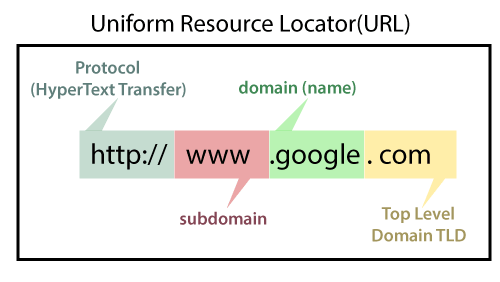
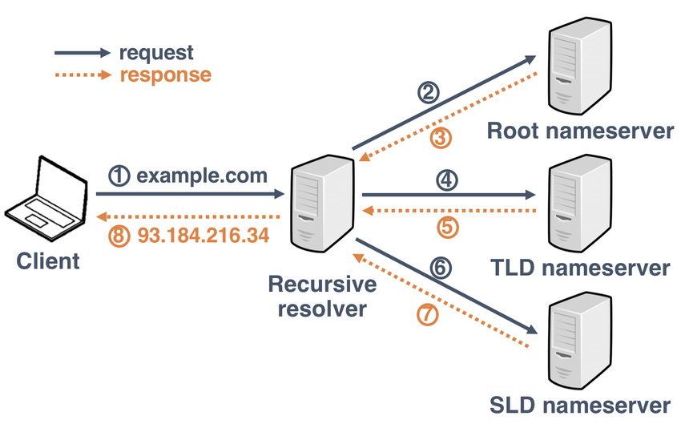
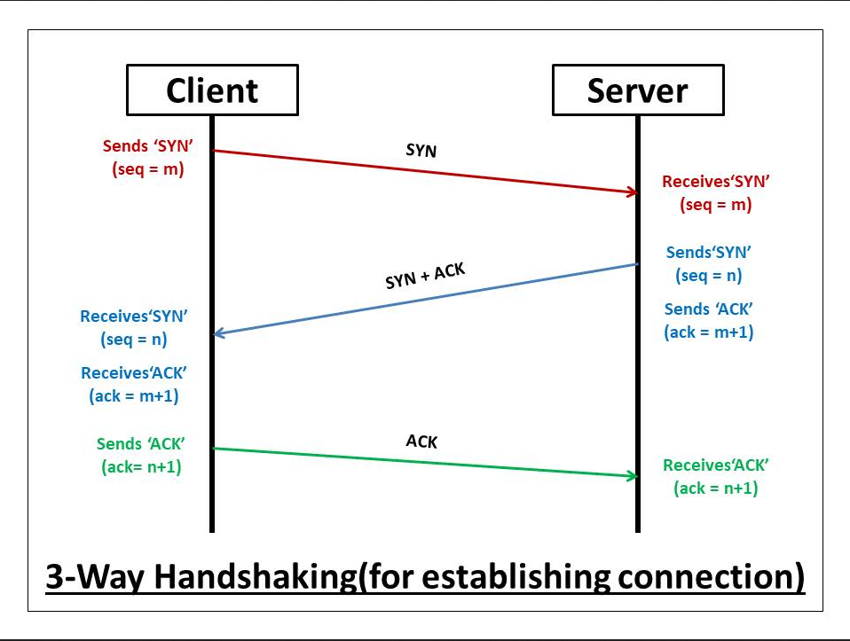
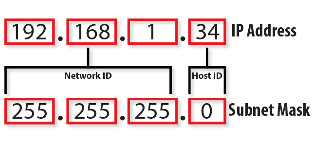
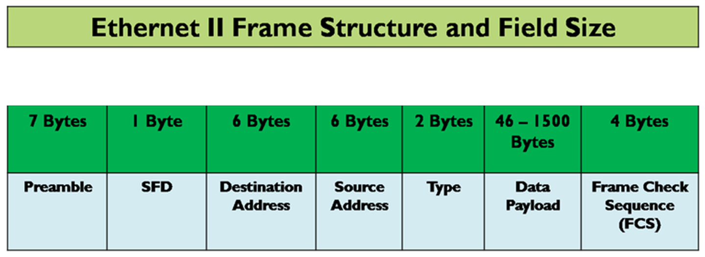

# Networks Summary

## Table Of Contents
- [The OSI Model](#the-osi-model)
- [Security](#security)
	1. [Firewalls](#firewalls)
	2. [IDS](#ids)
	3. [IPS](#ips)
- [DHCP](#dhcp)
- [DNS](#dns)
	1. [Domain Name Structure](#domain-name-structure)
	2. [Record Types](#record-types)
	3. [DNS Query](#dns-query)
- [TCP And UDP](#tcp-and-udp)
	1. [UDP](#udp)
	2. [TCP](#tcp)
- [IP](#tcp-and-udp)
- [Ethernet](#tcp-and-udp)
	1. [MAC Addresses](#mac-addresses)
	2. [Frame Structure](#frame-structure)
	3. [ARP](#arp)
- [Performance](#performance)
	1. [Load-Balancer](#load-balancer)
	2. [Proxy Server](#proxy-server)
- [Network Access Services](#network-access-services)
- [VPN](#vpn)
	1. [VPN Concentrator](#vpn-concentrator)
	2. [VPN Protocols](#network-protocols)
		- [IPsec](#ipsec)
		- [GRE](#gre)
		- [PPTP](#pptp)
		- [TLS](#tls)
		- [SSL](#ssl)

## The OSI Model
The OSI Model describes the layers that computers use to communicate over the network.
Modern internet does not use the OSI Model and instead uses a simplified version called TCP/IP Model however its good for visualizing communcation.
### Layer 1 - Physical
The first layer transmits raw bit streams over physical infrastructure,this means it gives an electrical single to signify 1 and no signal to singify 0.  
it also takes care of bitrate control and the layer is purely hardware.  

  
An example of a layer 1 device is a **network hub or repeater**.  
A network hub operates at the physical layer of a network. It functions by amplifying and regenerating signals without any analysis or interpretation of the data. Its primary purpose is to extend the reach of a network by boosting the signal strength, allowing it to travel further along the network cable.

an example of a layer 1.5 device is a **modem**,a modem translates a digital signal to an analog one and vice-versa to be used is a device used over a telecommunications network, such as a telephone line or cable line.  
it does not care where the signal came from or where it is going.

### Layer 2 - DataLink
The second layer is responsible for establishing a connection between two physical devices connected using the physical layer.  
it breaks up the information it receives into frames and sends them from one device to the other.
it uses MAC(Media Access Control) addresses to connect devices and define permissions to transmit and receive data.  

An example of a layer 2 device is a **switch**, a switch performs intelligent data forwarding based on MAC addresses. It analyzes the data frames it receives and determines the appropriate destination based on the MAC address of the recipient device.

### Layer 3 - Network
The third layer is responsible for determining the path data should go in,it allows for communication between two devices that are not directly connected.
information at this layer is called packets.
packets contain a source and destination ip addresses as well as the IP version (IPv4 or IPv6) in addition to the data.

An example of a layer 3 device is a **router**. A router operates at the network layer of a network. It performs intelligent packet forwarding based on IP addresses. It analyzes the packets it receives and determines the appropriate destination based on the IP address of the recipient device. 
 
It uses routing tables and protocols to determine the optimal path for the packets to reach their destinations. Routers also provide additional functionalities such as network address translation (NAT) and firewall capabilities to enhance network security.

### Layer 4 - Transport

The fourth layer ensures reliable and efficient end-to-end data delivery. It abstracts the transportation of data between devices. This layer also provides error detection, flow control, and end-to-end reliability through protocols such as TCP (Transmission Control Protocol) and UDP (User Datagram Protocol).
This layer allows us to communicate with multiple services running on the same device using **Ports** which is a number between 0 and 65535.

An example of a layer 4 protocol is TCP. TCP provides reliable, connection-oriented communication by establishing a virtual connection between sender and receiver. It guarantees data delivery, maintains the order of packets, and handles error recovery and congestion control.

### Layer 5 - Session
The fifth layer manages the establishment, maintenance, and termination of sessions between applications. It enables synchronization and coordination between communicating entities. This layer establishes checkpoints in data exchange, allowing for the resumption of communication if interrupted. It also handles session control and synchronization, authentication, and encryption services.  
Examples include RPC(Remote Procedure Call) and SCP(Session Control Protocol)
### Layer 6 - Presentation

The Presentation layer focuses on data representation, ensuring that information from the Application layer is properly formatted, encoded, and compressed for transmission. It handles encryption, decryption, and data conversion to provide a common format that applications can understand.  
Examples include SSL and Compression algorithms

### Layer 7 - Application

The Application layer provides network services directly to end users or applications. It enables communication and interaction between networked systems. Protocols at this layer offer specific services for various applications such as email (SMTP), web browsing (HTTP), file transfer (FTP), and more.

## Security

### Firewalls
A firewall is considered to be the first line of defence and can be places on multiple layers.
it can be placed on routers,hosts or even on its own device.
the purpose of a firewall is to examine each packet going through it against a set of rules,these rules can either allow or deny packets through the network and can be either incoming or outgoing rules specifying the direction of traffic.
If the packet being examined matches a certain rule it is enforced and it can block packets from entering or leaving the network.
#### Unidirectional Gateway
A unidirectional gateway is a network security device that allows data to flow in one direction only, while preventing any communication or data transmission in the opposite direction.  
It is designed to ensure the strict unidirectional flow of information from a less secure or untrusted network to a more secure or trusted network, while preventing any data leakage or unauthorized access from the secure network to the untrusted network.  

It is usually used in conjunction with replicated servers so that even if those servers are compromised they cant affect the main server as they are just copies.
### IDS
IDS or Intrusion Detection Systems is a passive system designed to detect when a security breach or an attack against the network is occuring,it does not prevent the attack on its own,rather it notifies the network administrator via a messaging system such as SMS or Email.  
The IDS receives a copy of all traffic in the network and uses a set of standards to evaluate the traffic and see if there is malicious activity.  
These standards include:

- **Signature Based:** checks traffic for known malware or attack signature which is effective against known malware.
- **Anomaly Based:** checks traffic for suspicious changes
- **Policy Based:** checks if traffic is compliant with a security policy

### IPS
IPS or Intrusion Prevention Systems is an active system designed to stop a securty breach or attack from compromising the network.  
In addition to informing the Network Administrator it is designed to perform an action or a series of actions to prevent further damage.  
For an IPS to work all traffic in the network must flow through the IPS device instead of it just getting a copy of the traffic.
All the traffic is evaluated using a set of standards identical to the IDS standards.  
The actions IPS can perform include:  

- blocking the offender IP Address
- Closing down the vulnerable interfaces
- Terminate the network session
- and more!
 3.
## DHCP
DHCP is a network protocol used to assign IP Addresses and other network configurations settings automatically to computers within a network,a DHCP servers centerally manages and dynamically allocates IP Addresses.

When a device connects to the network, it sends a DHCP request, and a DHCP server responds by providing a unique IP address from a predefined pool of available addresses.

In addition to IP addresses, DHCP can also provide other network configuration parameters to devices, such as subnet mask, default gateway, DNS (Domain Name System) server addresses, and other optional settings. This simplifies network setup by automatically providing necessary network information to devices.  
The process goes as follows:  

1. Computer boots up and sends a DHCP Discovery packet to a broadcast address on 255.255.255.255:67
2. The configured DHCP Server receives the DHCP Discovery packet and responds with an Offer packet that is sent directly to the MAC address of the Computer on port 68
3. The Computer receives the DHCP Offer packet and sends a request packet which requests the proper IP Configuration.
4. The DHCP Server receives the request and sends an Acknowledgement packet that contains the required IP Configuration
5. The Computer changes its IP Configuration to the one received from the DHCP Server.

DHCP leases IP addresses for a specific period of time. The DHCP server keeps track of leased addresses and their lease duration. Devices can renew their lease to retain the same IP address, or they can release the address when they no longer need it.

### Static IP
It is possible to get an IP Addresses without a DHCP Server by manually assigning an IP address along with a mask and all network configuation,this is used when we dont want the IP to be changed or released for a specific device.

## DNS
DNS or Domain Name System refers to the naming system that is used to translate human-readable domain names such as `example.com` to IP Addresses that computers can understand and use.

`example.com`--->`97.132.240.143`

Domain Name Translation is the first step when sending a message to a remote location since we need to know the *Address* of the server we want to communicate with.  

### Domain Name Structute
The domain name structure is a hierarchical structure composed of multiple parts separated by dots,each part is a different level in a hierarchy and together they specify a Fully Qualified Domain Name (FQDN)

First,Theres the Top-Level Domain(TLD),it is the 
highest level of the hierarchy and is at the rightmost part of the domain.  
Examples include:com,org,il etc.  
Every TLD has its own TLD Servers containing authoritative name servers.  

Then theres Second-Level Domain,this is the part that is left to the TLD and it represents a unique name inside the TLD, for example in `example.com` the SLD is `example`
Every SLD is contained in a Authoritative Name Server inside a Zone,when there is a country code such as `.co.il` the `co` is considered SLD,if there is a country code then `example` would be considered a Third Level Domain.

Lastly there are SubDomains,these exist as records within the zones that contain the SLDs,these help organize different services within the domain for example in `www.example.com` the subdomain is `www` and it may direct us to the webserver however `mail.example.com` could direct us to a mail server.
### Record Types
**A:** stands for Address and it contains the IPv4 Address for a specific hostname or domain
for example: `172.16.218.31`  
**AAAA:** contains the IPv6 Address for a specific hostname or domain for example: `2001:0db8:85a3:0000:0000:8a2e:0370:7334`  
**CNAME**: Stands for Canonical Name and points to another domain name,an alias.   
**TXT**: Allows the addition of descriptive text to a domain or hostname. Often used for verification or providing additional information.  
**NS**: Indicates the authoritative nameservers for a domain, specifying which servers are responsible for resolving the domain's DNS records. Example: `ns1.example.com` is an authoritative nameserver for `example.com`.

### DNS Query

 To get the ip address we use the DNS Protocol,it involves sending a query for a specific domain name and getting an ip address as the response.  
The process of DNS Querying for a site such as `example.com` is as follows:  

1. The Computer looks for `example.com` in its Local DNS Cache, if a previous request to the website was made recently the DNS Query resolved would be saved for future use.

2. If the IP Address is not present in the Local Cache a Recursive DNS Query is sent to a Recursive DNS Server, however first the router checks its own DNS Cache to see if the process can be shortened, the recursive DNS server is usually provided by the ISP or it can be a custom server in organizations.

3. The recursive DNS Server then makes a request to the root name server to request information about the TLD Server for `.com`.

4. After getting the Address of the TLD Server, the Recursive DNS Server makes a request to it asking for the address of the Authoritative name server responsible for `example.com`.

5. Upon receiving the address of the authoritative name server, it sends a DNS Query to it asking for the zone of `example.com`.

6. Within the zone, the authoritative nameserver looks for the A record (IPv4) of `example.com`.

7. The Recursive DNS Server returns a DNS Response to the Computer, which includes the IP Address for `example.com`.

DNS TTL (Time to Live) is a value in a DNS record that indicates how long the information can be cached by DNS resolvers and other systems before it should be refreshed from the authoritative DNS server.

## TCP And UDP
TCP And UDP are both Layer 4 protocols that serve the purpose of providing transport layer services in computer networks, with TCP offering reliable and ordered data delivery, while UDP offers faster and connectionless communication for applications that prioritize speed over reliability.

>Data on the 4th layer is called segments but i refer to them as packets since every segment is encapsulated in a packet
### UDP
UDP(User Datagram Protocol) is a connectionless transport layer protocol meaning it does not ensure the delivery of packets and their order of arrival,this allows it to function faster sacrificing reliability.  

The UDP Header adds a source and destination port to the Data,the length of the data with the header and a checksum result.  

To mitigate the reliability issue with UDP a checksum function is used to check for errors and the result of that function is sent along with the data,this ensures that wrong information is dropped.   
UDP has many use-cases,including real-time communication and DNS Querying.

### TCP
TCP is the most common connection-based transport layer protocol,this means first a connection between two devices is established and any data sent will be sent over that connection.

TCP was designed to work over an unreliable network,meaning it assumes that data can be lost,in addition to reliability TCP also ensures order of packets.
Just like UDP the TCP header contains the source and destination ports,checksum. 

TCP assigns a **Sequence Number** for each byte sent,a field called Seq is assigned to the first byte in a message so for example is a message: `Hello Seq=100` then next message will be `World Seq=105` because we assign the value of 100 to H,then we add 4 more bytes `ello` which means the next byte would be `105`

 When a package is received in TCP the recipient sends an ACK(Acknowledge) message to the sender notifying it that the message was received correctly. The ACK Packet contains the next sequence number expected.
when an ACK message is not sent after a certain period of time the message is resent by the sender. 
#### Connection Establishment

The way of establishing a connection in TCP is also called the three-way handshake.  
The process is as follows:  

1. First packet is sent with a **SYN** flag set to 1 in the TCP Header,along with an inital Seq number,called the ISN which is randomly generated to avoid conflict between connections and the ACK flag set to 0.
2. The Server then responds with a **SYN+ACK** packet which also has a its own SYN Flag set to 1 and ACK flag according to the Seq the client sent,its own Seq value is also randomly generated as its a separate stream of bits than the client to server one.
3. Lastly the client sends an ACK packet to the SYN packet sent in the second step,this establishes the connection.

## IP
IP or Internet Protocol is a protocol used for addressing and routing data packets across networks in order to enable communication between devices connected to the internet.

IP Addresses are the identifiers of devices on a network and include information about the network to which the device is connected and the specific address of the device within that network.  

IP Ranges are denoted by CIDR blocks,those indicate how many of the bits in the address are constant.  
meaning `192.168.0.0/24` is `192.168.0.0 - 192.168.9.255` 

IP Addresses are devided into two,Network ID and Host ID.  
network ID represents the network portion of the IP address and identifies the specific network to which the device is connected. The host ID represents the host portion of the IP address and identifies the specific device within that network.  

Those Two are divided by the subnet mask,the subnet mask is a 32 bit value contains a series of 1s followed by a series of 0s, where the 1s represent the network portion and the 0s represent the host portion.

With IP addresses, specific classes are used to designate the type of IP address visible to any network or individual. Currently, there are 5 IP classes in total: Class A, Class B, Class C, Class D, and Class E. The IP classes are defined as follows:

-   **Class A**: Large networks or entire ISP networks
-   **Class B**: Medium to large corporate organizations as well as more extensive networks or companies
-   **Class C**: Used for those on smaller networks or ISPs
-   **Class D**: Often used for those interested in multicasting
-   **Class E**: Typically reserved for experimental casting or use as well as for reserved addresses based on the ISP

#### Special IP Addresses
**255.255.255.255:** a broadcast address used to send data to all devices on the network
**127.0.0.1:** a loopback address used to send data to itself
#### NAT
NAT(Network Address Translation) is a technique used in networking to allow multiple devices in a private network to share a single public IP address. It translates private IP addresses to a public IP address when communicating with devices outside the private network, and vice versa.

#### Routing Table
A routing table is a data structure stored in a network device, such as a router, that contains information about the available routes to different network destinations.  
It is used by the device to determine the optimal path for forwarding data packets to their intended destinations.  
The routing table includes information about network addresses, next-hop routers, and the cost or preference associated with each route.
#### IPv6
Contrary to the IPv4 addresses displayed earlier such as `192.168.0.1` IPv6 addresses are 128-bit addresses represented in hexadecimal format.                
IPv6 addresses are structured in eight groups of four hexadecimal digits separated by colons, such as `2001:0db8:85a3:0000:0000:8a2e:0370:7334`.   To simplify the representation of IPv6 addresses, consecutive blocks of zeros within an IPv6 address can be replaced with a double colon (`::`) and blocks starting with zeros themsleves can just contain the non zeros.   
The address would be shortened to `2001:db8:85a3::8a2e:370:7334`
## Ethernet
Ethernet is a protocol used by NICs and it is a layer 2 protocol used for direct communication between two devices,also called LAN communication.  
Ethernet defines the standards for the physical and data link layers of the OSI model, including the format of the data packets, addressing schemes, and protocols for error detection and correction.
### MAC Addresses  
In order for two network cards to communicate they need Identifiers,for those we use MAC Addresses burned into the NICs  themselves.  
MAC Addresses are divided into two parts:  

- **Vendor ID:** The first 3 bytes identify the company that produced the network card 
- **Host ID:** The other 3 bits are an Identifier specific to the network card

**Broadcast MAC Address:** `FF:FF:FF:FF:FF:FF` is a special MAC Address used to send a frame to all hosts in a network.

### Frame Structure

- **Preamble:** constant sequence of bytes to sync two devices and notify the start of a new frame
- **Destination Address:** Destination MAC Address
- **Source Address:** Source MAC Address
- **Type:** The Frame type indicates the encapsulated data protocol for example `0x0800` means IPv4 and `0x86DD` is IPv6
- **Data:** The payload of the frame,has to contain at least 64 bytes so if the message is shorter the data is padded with 0s.
- **CRC32/FCS:** a checksum field using the CRC32 algorithm
### ARP
ARP or Address Resolution Protocol is a protocol used to map an IP address to a MAC address within the Ethernet network.  
When a computer A wants to communicate with another computer B on the same network an ARP request is broadcasted on the network,this request contains the question `does anyone know the MAC address for Computer B's IP Address?`,then an ARP response is sent by Computer B or any device that knows computer B's mac address such as a router.  
This ARP Response is then cached on Computer A.  
When the second computer is not on the same network the ARP Request is sent to the default gateway. 
## Performance

### Load-Balancer
A load-balancer is a network appliance that is used to balance workloads and traffic across multiple devices in a network that contain the same data processing capabilities.

it is used to optimize performance and maximize efficiency by ensuring that the servers dont get overloaded,additionally if only one server goes down the traffic is routed to a healthy server ensuring high availability of the service.

### Proxy Server
A proxy server is a network appliance that is used to make requests for resources on behalf of another client machine,it can be though of as a messenger.  
It is often used to retrieve information from untrusted sources,filter incoming data and increase performance by caching web requests.
## Network Access Services
### Network Interface Controller
Also called NICs, it is the way in which a device connects to the network.
It operates both at layers 1 and 2 of the OSI model.  

At layer 1 (Physical), NICs handle the conversion of network traffic into bit streams, which are the raw digital signals transmitted over the physical network medium. They handle tasks such as encoding and decoding electrical signals or light signals for transmission and reception.

At layer 2 (Data Link), NICs are responsible for determining the appropriate networking protocols to be used, such as Ethernet or Point-to-Point Tunneling Protocol (PPTP).  

They encapsulate data into frames, assign MAC addresses (which are burned into the NIC's hardware), and perform functions like error checking and flow control.

### RADIUS
Remote Authentication Dial-In User Service (RADIUS) is a networking protocol and AAA (Authentication, Authorization, and Accounting) framework widely used for centralized authentication, authorization, and accounting management in network access scenarios.

RADIUS operates at the application layer (Layer 7) of the OSI model. It provides a means for devices such as routers, switches, or access servers to communicate with a central RADIUS server for user authentication and authorization. When a user attempts to access a network resource, the device they connect to sends their credentials (username, password) to the RADIUS server. The RADIUS server then verifies the credentials against its user database and sends back a response indicating whether access should be granted or denied.

## VPN
VPN or Virtual private network is a secure connection established between a remote host to access a private network through an encrypted tunnel through a public network.

Once the connection is established the remote host is no longer seen as remote and is considred part of the private network,although the traffic still traverses the public internet the connection from both endpoints is seen as direct.
VPN is a cheaper way to connect remote endpoints since it does not require the use of a dedicated line.  
VPNs also offer privacy benefits by masking the user's IP address and encrypting their internet traffic.

There are multiple VPN types:

- **Site-To-Site:** allows a remote site's network to connect to a main site's network and be seen as a segment of the private main network,this connection is maintained by VPN Concentrators on both ends.
- **Remote Access:** or Host-To-Site VPN allows a remote user to connect to a local network,the connection is managed by a VPN Concentrator on the local network side and the remote user uses software called a **VPN Client** to make the connection 
- **Host-To-Host:** allows a secure connection to be established directly between the two individual hosts or devices without the need for a central VPN concentrator.

### VPN Concentrator
The concentrator provides authentication,encryption and tunneling protocols that are used to support the establishment and management of multiple VPN connections.  
most provide IPSec encryption through a secure channel on layer
### VPN Protocols

#### IPsec
IPsec or Internet Protocol Security is a set of protocols that work at layer 3 and above of the OSI Model and it is the most common suite of protocols that is used with VPN Connections.

It can be used with the **AH(Authentication Header) Protocol** which offers only an authentication header with no encryption or it can be used with **ESP(Encapsulating Security Payload)** which offers both authnetication and encryption of the payload and is considered the more popular approach.

Both Protocols can operate in two mods:

- **Transport Mode:** between two devices such as host-to-host VPN,only the payload gets encrypted and authenticated while the IP header stays intact
- **Tunnel Mode:** between two endpoints such as site-to-site VPN, the original IP packet is encapsulated within a new IP packet with an additional IPsec header.
 
IPsec requires a robust key management system to handle the generation, distribution, and rotation of encryption keys. Key management protocols like Internet Key Exchange (IKE) are commonly used to automate the negotiation and management of cryptographic keys.
#### GRE
GRE or Generic Routing Encapsulation is a tunneling protocol capable of encapsulating a wide variety of network layer protocols.
GRE is often used to create a sub-tunnel inside an IPsec connection which enables the broadcasting of IPsec packets to multiple endpoints.  
GRE adds a new IP header to the original packet, encapsulating it for transport. This enables the transmission of non-IP protocols, multicast traffic, and VPN data over IP networks.
#### PPTP
Point To Point Tunneling Protocol is an older protocol that supports dial-up vpn and lacks security,however microsoft added GRE to it improving the security.

#### TLS 
 Transport Layer Security is a cryptographic protocol used to create a secure encrypted connection between two end devices or applications.  
 It operates at layer 5 and 6 of the OSI model, enhancing the security of data transmission over the underlying network protocols.
 
 TLS ensures the confidentiality and integrity of data transmitted over the network by encrypting the communication channel. It provides authentication, key exchange, and encryption algorithms to protect against eavesdropping, tampering, and unauthorized access.
#### SSL
SSL is an older cryptographic protocol that is very similar to TLS.  
TLS is considered more secure than SSL. SSL 3.0 had several security vulnerabilities, leading to its deprecation. TLS has undergone more rigorous scrutiny and enhancements to address security weaknesses found in SSL.

*[TLD]: Top Level Domain