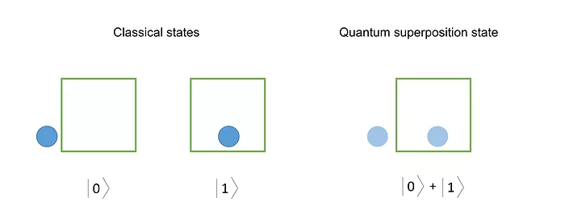

# Quantum Computing Summary

## Table of contents

## What is Quantum Computing

The field of quantum computing emerged in the 1980s. It was discovered that certain computational problems could be tackled more efficiently with quantum algorithms than with classical ones.

Quantum computing uses specialized technology including computer hardware and algorithms that take advantage of quantum mechanics to solve complex problems that classical computers or supercomputers can’t solve, or can’t solve quickly enough.

#### Use Cases
Quantum Computing could benefit many fields thanks to its ability to perform many calculations simultaneously for example:  

- **Machine Learning:** The use of quantum computing techniques would enable faster training and inference in machine learning models with the usage of specialized Quantum Neural Networks, Quantum PCA and more. The optimization of machine learning models will lead to an expansion of the real time models pool and introduce advanced machine learning into more use cases.  

- **Percision Measurements:**  Quantum computing techniques can enhance measurement precision beyond classical limits. This has applications in fields like navigation, geolocation, and medical imaging.  

- **Secure Communication:** The property of Quantum Entaglement could be utilizied for secure communication (Quantum Cryptography) to allow for eavesdropping detection and defense against quantum threats in contrast to classical cryptography.  

### Quantum Computers
Quantum Computers use quantum mechanics principles such as superposition or entanglement to perform operations on data using specialized hardware that supports the preparation and manipulation of quantum states.  

#### Qubits
Quantum bits, or qubits, are represented by quantum particles.  
The qubit is used by quantum computers as the basic unit of information, similar to its classical counterpart the "bit".  
Unlike a "bit" which can only have two states, a "1" or a "0", a Qubit can exists in a superposition of its two "basis" states.  

For example, if a qubit is in a state $∣ψ⟩=α∣0⟩+β∣1⟩$, where $α$ and $β$ are complex numbers, then $∣α∣^2$ represents the probability of measuring the qubit to be in state $∣0⟩$ and $∣β∣^2$ represents the probability of measuring the qubit to be in state $∣1⟩$. These probabilities must sum to 1, ensuring that the qubit is in one of the two states upon measurement.

#### Quantum Gates
To achieve entaglement and manipulation of qubits quantum computers use **Quantum Gates**, allowing for the execution of quantum algorithms and computations.  
they preserve the normalization of quantum states and are reversible. This property ensures that quantum computations are deterministic and can be undone, facilitating the implementation of quantum algorithms.

Quantum gates can create, manipulate, and exploit quantum superposition and entanglement, which are key features of quantum mechanics. By applying gates to qubits in superposition or entangled states, quantum computations can explore multiple computational paths simultaneously, enabling parallelism and potential computational speed-ups.

For example, a single-qubit gate may rotate the state of a qubit around a specific axis in the Bloch sphere, while a two-qubit gate may entangle or disentangle the states of two qubits.
### Historical developments

Currently, no quantum computer can perform a useful task faster, cheaper, or more efficiently than a classical computer. Quantum advantage is the threshold where we have built a quantum system that can perform operations that the best possible classical computer cannot simulate in any kind of reasonable time.

According to global energy leader Iberdola, "quantum computers must have almost no atmospheric pressure, an ambient temperature close to absolute zero (-273°C) and insulation from the earth's magnetic field to prevent the atoms from moving, colliding with each other, or interacting with the environment."

"In addition, these systems only operate for very short intervals of time, so that the information becomes damaged and cannot be stored, making it even more difficult to recover the data."5 
## Core Principles
#### Dirac Notation

### Quantum States
Quantum States are the fundumental descriptions of systems in quantum mechanics.  
They represent all the information that can be known about a quantum system, including its properties, characteristics, and potential measurement outcomes.

Quantum states are typically represented using mathematical objects called state vectors or wavefunctions. These state vectors encode the probabilities of different possible outcomes of measurements that can be made on the system.

$∣ψ⟩=α∣0⟩+β∣1⟩$

In this representation:

- $∣ψ⟩$ represents the quantum state of the qubit.
- $α$ and $β$ are complex probability amplitudes.
- $∣0⟩$ and $∣1⟩$ are the basis states representing the classical states of the qubit.

When a measurement is made on a quantum system, the system's state "collapses" into one of the possible measurement outcomes, according to the probabilities encoded in its state. This measurement process is probabilistic, and the outcome is not predetermined but determined by the inherent randomness of quantum mechanics.
###	Superposition
Superposition is one of the fundamental concepts of quantum mechanics, it describes the ability of quantum systems to exist in multiple states simultaneously and is one of the key features that distinguishes quantum physics from classical ones.  

For example, a light switch can be either "ON" or "OFF" but in quantum mechanics it can be both on and off at the same time with varying probabilites until the states of it is measured to be one or the other

The concept of superposition allows quantum systems to explore multiple possible states simultaneously, which has profound implications for quantum computing, cryptography, and information processing. Superposition lies at the heart of many quantum algorithms, enabling quantum computers to perform multiple calculations in parallel and potentially achieve exponential speed-ups over classical computers for certain problems.
### Entaglement
Quantum Entaglement refers to a phenomons in quantum mechanics in which the state of two or more particles is correlated in such a way that one particle's state is dependent on the other and measuring one of them will affect the other's measurement.  
An important property of this phenomenon is that it persists regardless of the distance between the entagled particles and can occur instantaneously, violating the principle of locality in classical physics.  

Quantum entanglement has applications in various areas of quantum information science, including quantum cryptography, quantum teleportation, and quantum computing. For example, entanglement is used in quantum teleportation protocols to transfer the quantum state of one particle to another over long distances without physically moving the particle itself.

In quantum computing, entanglement is typically created by applying two-qubit gates (also known as entangling gates) to pairs of qubits. These gates introduce correlations between the qubits' states, examples include:  

- **Controlled-NOT (CNOT) Gate:** The CNOT gate is one of the most commonly used entangling gates in quantum computing. It acts on two qubits, a control qubit (often denoted as "c") and a target qubit (often denoted as "t"). If the control qubit is in the state |1⟩, the CNOT gate flips the state of the target qubit. In effect, it entangles the two qubits, creating a Bell state.

- **Controlled-Z (CZ) Gate:** The CZ gate, also known as the controlled-phase gate, entangles two qubits by applying a phase shift to the target qubit depending on the state of the control qubit. It flips the phase of the target qubit if the control qubit is in the |1⟩ state.

- **SWAP Gate:** The SWAP gate exchanges the states of two qubits. While it may not directly create entanglement, it can be used in combination with other gates to transfer entanglement between qubits or to reconfigure the entanglement structure of a quantum system.

### Decoherence
Decoherence is a phenomenon in quantum mechanics where a quantum system becomes entagled with its enviornment, essentiallty it means that the quantum superposition and entaglement degrade over time due to interactions with the surrounding enviornment through collisions or electro-magnetic fields.

Decoherence poses a significant challenge for quantum computing and other quantum technologies, as it can cause errors in quantum computations and degrade the performance of quantum systems. Maintaining coherence and mitigating decoherence effects are essential for realizing the potential of quantum technologies.

Researchers are actively studying ways to mitigate decoherence through techniques such as error correction, quantum error correction codes, and environmental isolation. By minimizing interactions with the environment and implementing error correction strategies, it's possible to extend the coherence times of quantum systems and improve the reliability of quantum computations.
### Quantum Error Correction

## Linear Algebra in Quantum Mechanics

### Essential Mathematical Tools: Vectors, Matrices, and Tensor Products

### Application of Linear Algebra in Quantum Computations

## Quantum Algorithms

### Overview and Classification of Quantum Algorithms
### Detailed Exploration of Shor’s and Grover’s Algorithms

## Quantum Communication
### Quantum Teleportation
### Quantum Secret Sharing
### QKD

<scripts>
<html><head>
	

</head></html>
</scripts>

