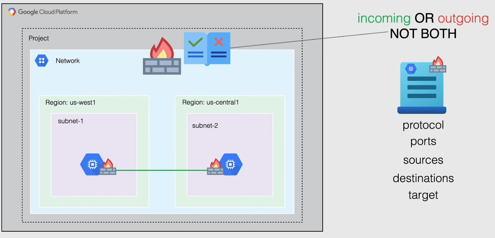
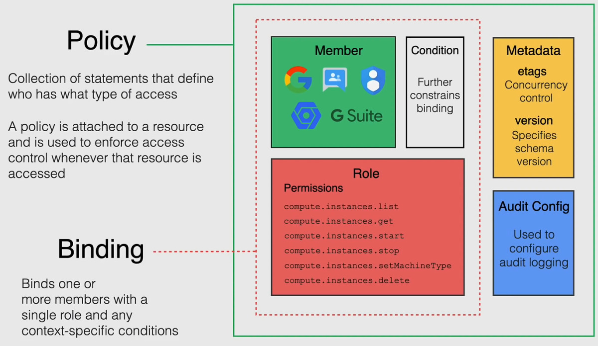

# Second week summary:

## Table of contents

- [Cloud Computing](#cloud-computing)
	1. [What Is Cloud Computing?](#what-is-cloud-computing)
	2. [Why Do We Need It?](#why-do-we-need-it)
	3. [Cloud Computing Types](#cloud-computing-types)
		- [Public Cloud](#public-cloud)
		- [Private Cloud](#private-cloud)
		- [Hybrid Cloud](#hybrid-cloud)
	4. [Cloud Service Models](#cloud-service-models)
		- [Iaas](#iaas)
		- [Caas](#caas)
		- [Paas](#paas)
		- [Faas](#faas)
		- [Saas](#saas)
- [Storage](#storage)
	1. [Object Storage](#object-storage)
	2. [File Storage](#file-storage)
	3. [Block Storage](#block-storage)
- [Google Cloud Platform](#google-cloud-platform)
	1. [GCP Global Infrastructure](#gcp-global-infrastructure)
	2. [GCP Compute Services](#gcp-compute-services)
		- [GCP IAAS(Compute Engine)](#gcp-iaascompute-engine)
		- [GCP CAAS(Google Kubernetes Engine)](#gcp-caasgoogle-kubernetes-engine)
		- [GCP PAAS(App Engine)](#gcp-paasapp-engine)
		- [GCP FAAS(Cloud Functions + Cloud Run)](#gcp-faascloud-functions-cloud-run)
	3. [GCP Storage and Database Services](#gcp-storage-and-database-services)
		- [Cloud Storage](#cloud-storage)
		- [File Store](#file-store)
		- [Persistent Disks](#persistent-disks)
		- [GCP SQL Databases](#gcp-sql-databases)
		- [GCP NoSQL Databases](#gcp-nosql-databases)
	4. [GCP Networking Services](#gcp-networking-services)
		- [Virtual Private Cloud](#virtual-privae-cloud)
		- [Firewall Rules](#firewall-rules)
		- [Routes](#routes)
		- [Load Balancing](#load-balancing)
		- [Google Cloud DNS](#google-cloud-dns)
		- [Cloud VPN](#cloud-vpn)
		- [Direct Interconnect](#direct-interconnect)
	5. [Google Resource Hierarchy](#google-resource-hierarchy)
	6. [Google Cloud IAM](#google-cloud-iam)
## Cloud Computing

### What is Cloud computing? 
**Cloud Computing is the delivery of a shared pool of different computing services over the internet to process,store and network data.**  
It allows users to access and use computing resources such as virtual 	machines,storage,databases,software applications and networking capabilities.  
it does all of that without the need for on-premises datacenteres or direct management,all of the hardware is owned by someone else called the **Cloud Service Provider (CSP)**.  
The resources are shared among many users and to not affect each other cloud providers use isolation techniques and allocation of resources based on demand,this provides mitigation of performance impact and security.

### Why do we need it?
- **Scalability:** Cloud computing enables businesses to easily scale their resources up or down based on demand, ensuring efficient utilization and cost optimization.
it is also possible to scale automatically according to load or demand,that ability is called **Elasticity**.

- **Cost Effective:** Cloud services eliminate the need for upfront investments in hardware and infrastructure, reducing capital expenses and allowing pay-as-you-go pricing models.

- **Flexibility and Accessibility:** Cloud computing enables access to data and applications from anywhere, using any device with an internet connection, facilitating remote work and collaboration.

- **Reliability and Availability:** Cloud providers offer robust infrastructure, redundancy, and backup mechanisms, ensuring high availability and reliable access to services and data.

- **Less Reponsibility:** The responsibility of handling the infrastracture,security and availability of the services falls onto the cloud service provider,eliminating the need of hiring it staff etc.

### Cloud Computing Types

#### Public Cloud

Computing services offered by 3rd party providers over the public internet,making them available to anyone who wants to purchase and use them.    
Public clouds can be connected together and used within a single enviornment,that is called **Multi-Cloud**.  
Public clouds are a good choice for companies and organizations with low-security concerns.  
There is no need to manage these resources as cloud computing providers configure and manage these services.  
 Generally, public clouds are used for application development and testing.   
**Examples include: AWS, GCP, Azure**  

#### Private Cloud  
Computing services that exist on-premises and are not available for public access while still using Cloud Computing technologies.  
Private clouds are often preferred by organizations that have strict compliance, security, or performance requirements.  
Private clouds are more costly than public clouds due to their costly maintenance.  
**Examples include: AWS Outposts, Anthos, Azure Stack**

#### Hybrid Cloud
A combination of Private and Public cloud enviornments,allowing organizations to leverage the benefits of both. In a hybrid cloud model, organizations can use their private cloud infrastructure for sensitive or critical workloads that require strict control, compliance, or high performance. At the same time, they can utilize public cloud services for less sensitive workloads, benefiting from the scalability, cost-effectiveness, and flexibility of the public cloud.  

### Cloud Service Models

#### Iaas
cloud computing service model where users have access to virtualized computing resources over the internet. It provides virtualized hardware infrastructure, such as virtual machines, storage, and networks, allowing users to manage and control their operating systems, applications, and data. Users are responsible for managing and maintaining the software stack, including the operating system, middleware, and applications.
**For example: Google Compute Engine, AWS EC2**  

This means renting computer services like servers over the internet and having close to full control.
#### Caas
 cloud computing service model that provides a platform for deploying, managing, and orchestrating containers. Containers are lightweight, isolated, and portable environments that encapsulate an application and its dependencies. CaaS platforms, such as Kubernetes, enable users to deploy and scale containerized applications easily. Users focus on managing and deploying containers, while the cloud provider manages the underlying infrastructure and container orchestration.
**For example: Google Kubernetes Engine , AWS Elastic Kubernetes Service**    

This means only needing to manage the configuration of the container and not the interaction between different containers.
#### Paas
computing service model that offers a platform on which users can develop, deploy, and manage applications without the complexity of underlying infrastructure. PaaS provides a runtime environment with pre-configured infrastructure components, including operating system, middleware, and development tools. Users can focus on coding, application development, and deployment, while the cloud provider handles infrastructure management, scaling, and maintenance.   
**For example: App Engine, AWS Elastic Beanstalk**  

This means only developing code and not worrying about dependencies like runtimes and operating systems,less control but less maintenance,however this supports a limited amount of code frameworks usually.
#### Faas
also known as serverless computing,cloud computing service model where users can execute code in the form of functions without managing the underlying infrastructure. Users write and upload code functions, and the cloud provider handles the execution, scaling, and management of those functions based on triggers or events. FaaS allows developers to focus solely on writing code without worrying about infrastructure provisioning or server management.
**For example: Google Cloud Functions, AWS Lambda**  

This means writing code to be executed as functions based on some event like http request or writing to a database etc.  
this is different from paas because you dont need to worry about deployment or the underlying infrastructure and only about small functions that are executed based on events.  
#### Saas
cloud computing service model where users can access and use software applications over the internet on a subscription basis. The software is centrally hosted and maintained by the cloud provider, who manages the underlying infrastructure, including servers, databases, and application updates. Users can access the software through web browsers or thin clients, eliminating the need for local installation and management.
**For example: Gmail, DropBox**  

This means using third party software hosted on a cloud and not having to worry about anything except some minimal configuration

## Storage

### Object Storage
Object Storage is a system that devides data into separate self contained units that are re-stored in a flat enviornment with all objects at the same level.  
an object can be any kind of file.  
the are no folders or hierarchical structure but it also doesnt store all of the data in a single file.  
objects contain metadata which is information about the file that helps with processing and usability.  
instead of using a file name or path to access an object, each object has a unique identifier.
### File Storage
File storage systems organize data into files and folders, creating a hierarchical structure for organizing and accessing the data. The file storage system manages this organization and stores information about the hierarchy along with the data itself. This eliminates the need for an external file system to access and manage the files.  
The convenience of file storage lies in its ability to provide a familiar and intuitive way of organizing and sharing data. Multiple users can access the files and collaborate within the file storage system, as it maintains the necessary information about the file hierarchy and access permissions.

### Block Storage
Block storage systems divide storage space into fixed-size blocks or chunks. These blocks are typically a few kilobytes or megabytes in size. When storing data, it is divided into these blocks and then stored on the storage medium, such as hard disks or solid-state drives (SSDs). Each block is assigned a unique address or identifier.  

When accessing data from block storage, the system retrieves the specific blocks that contain the desired data. This direct access allows for faster retrieval and modification of data compared to other storage types. Block storage is commonly used for structured data, such as databases, where the data is divided into smaller chunks for efficient management and processing.

> **In simple terms object storage is the same as putting your data into a box,writing a number on the box and some information about yourself,infomration about the data and what it is used for and then putting that box onto a shelf(bucket).  
the box size is irrelevent cause the shelf can hold any size of box and grow when needed.**  

> **block storage would be dividing the shelf into equal units of storage,such as 1 meter segments and then filling that 1 meter with as many boxes as you can fit,once you reach the limit you use the next segment,if a box is too large you use multiple segments for one box**
## Google Cloud Platform
Google Cloud Platform or GCP is a collection of cloud computing services provided by google that offers a variety of different infrastracture and platforms to build,deploy and scale applications and services in the cloud.    

Google Cloud Platform provides a robust set of cloud services, including computing power, storage options, machine learning tools, data analytics, networking, and developer tools. Some of the key services offered by GCP include Google Compute Engine (virtual machines), Google Kubernetes Engine (container orchestration), Google Cloud Storage (object storage), Google BigQuery (data analytics), and Google Cloud AI (artificial intelligence and machine learning).  

GCP allows businesses to leverage Google's global infrastructure and data centers, providing scalability, reliability, and security for their applications and data. It offers a user-friendly interface, command-line tools, APIs, and SDKs to manage and interact with the cloud services.

### GCP Global Infrastructure

The GCP Global infrastructure refers to the global presence of data centers,networking and cloud resources available for use. Google has one of the most powerful infrastructures in the world.

Google holds a low latency network where your traffic stays on google's private network for most of its journey ensuring high performance and a user experience that is always above the norm.  

Google's network is designed to serve users all around the world,it is designed with redundant cloud regions connected with high bandwidth fiber cables and subsea cables connecting different continents as can be seen in the diagram above.

When a request is made to a service in google cloud,google responds from a Point Of Presence(POP) or Edge Network location that provides the lowest latency,in this POP different Internet Service Providers(ISPs) can connect to google's network.
The POP receives the request and passes it to the closest google datacenter over the private fiber network. 

#### Geography And Regions

- **Multi-Regions:** A large geographic area, such as the United States, that contains two or more geographic places.

- **Regions:** collections of zones that provide high-bandwidth, low-latency network connections to other zones in the same region.
Regional resources can be used by any resource in that region, regardless of zone.
Generally, communication within regions will always be cost-efficient and faster than communication across different regions.

- **Zones:** an isolated location within a region and is composed of several physical infrastructures housed in a data center called cluster. Resources that live in a zone such as virtual machines or persistent disks are referred to as zonal resources. Zonal resources can only be used by other resources in the same zone. The fully-qualified name for a zone is made up of `<region>-<zone>`  
for example: us-central1-a is the zone a inside the region us-central1. 

- **Clusters:** distinct physical infrastructure that is housed in a data center.

- **Network Edge Location or POP:** Offers connection to Google Cloud services from different locations across metropolitan areas.

### GCP Compute Services
GCP offers a variety of different compute services,ranging from most flexible and highest responsibility (IAAS) to least flexible and least responsibility (FAAS) as can be seen from this diagram: 

#### GCP IAAS(Compute Engine)  

Compute Engine is Google Cloud's IaaS product that offers VMs called instances,they can be deployed in any region or zone you choose. You can decide the operating system and the software you decide to put on it.
Google gives you the option of creating these instances using public or private images that serve to make the deployment process easier,you can use pre-configured images and software packages available in the **Google Cloud Marketplace**  

The ability to manage multiple instances is provided using **Instance Groups**,it is possible to add or remove capacity for the instance within a group using **autoscaling with instance groups**

For storage you can attach and detach disks as needed as well as use **Google Cloud Storage** as another storage option.

connection to the google compute engine VMs is granted through SSH
#### Virtualization
Virtualization is the process of creating a software-based representation or a simulation of a hardware resource such as an operating system, server, storage device, or network resource.  

In the context of virtual machines virtualization means creating a machine with its on operating system,cpu cores and storage on top of an existing machine using something called a **hypervisor**.  

A hypervisor's role is to allocate resources for a VM and to manage all system calls the VM executes,it exists between the os and the vm.
there are 2 types of hypervisors:

- The baremetal hypervisor runs directly on the hardware using hardware virtualization technologies such as Intel VT-X and is usually the more performant type.
- The second type of hypervisor runs on top of an existing os and does not rely on hardware.

#### GCP CAAS(Google Kubernetes Engine)  

Google Kubernetes Engine or GKE is google cloud's container orchestration system for automation,deploying,scaling and managing containers.
It uses Compute Engine Instances (VMS) as **Nodes** in a **Cluster**

#### GCP PAAS(App Engine)
App Engine is a fully managed serverless platform for developing and hosting web applications at scale.
App engine handles most of the management of the resources for you,if your app is in need of more computing resources google automatically scales the system to provide the resources.  

Google also hanldles automatic security updates as well,all you need to take care is to build you application.
while there is a limited amount of supported technologies and languages you can use custom runtimes to allow you to write in any language.
it allows interaction with other google services such as Google Cloud Storage seamlessly and even 3rd party vendors such as other cloud providers.

#### GCP FAAS(Cloud Functions + Cloud Run)

##### Cloud Functions
it is a Serverless Execution Enviornment for build and connecting cloud services,you use simple single-purpose functions that are attached to events which are produced from your infrastructure and services in google cloud.  
A function is trigged when an event being watched is fired.
Your code then executes in a fully managed enviornment.

##### Cloud Run
it is a Fully managed compute platform for deploying and scaling containerized applications quickly and securly.
it abstracts away all infrastructure management by automatically scaling up and down depending on traffic.  
This is known as **Serverless For Containers**,you can write Cloud Run in any language library and binary.  

Cloud Run is usually more Suitable for larger applications packaged in containers while cloud functions are designed for smaller,event driven functions.

### GCP Storage and Database Services

#### Cloud Storage

Cloud storage is a scalable and durable object storage service.
It allows you to store and retrieve any amount of data, such as files, images, videos, backups, or logs, in a secure and highly available manner.  

Durability means it is very unlikely to lose files.
It has unlimited storage with no minimum object size.  

You can freely use cloud storage and its use cases are content delivery,data lakes and backup.  
It is available in different storage classes:  

- Standard: offers the maximum availability with your data with no limitations,good for storage that is frequently accessed
- Nearline: offers lower cost archival storage for files accessed less than once a month.
- Coldline: offers an even lower cost archival storage for files accessed less than once every 3 months.
- Archive: offers the lowest cost archival storage for files accessed less than once every year.

It is also available for storage in multiple availability options such as region,dual region and multi-region.

#### File Store
A fully managed NFS file server,it is a managed network file service that operates at the file level, allowing you to create and manage file shares accessible by multiple instances.

#### Persistent Disks  
Persistent disks offer durable block storage for instances,it comes in multiple options:  

- Standard: gives you regular standard storage in a reasonable price
- Solid State(SSD): gives you lower latency and higher iops  

They are used to store data that needs to persist even after the associated virtual machine (VM) is terminated.

#### GCP SQL Databases

##### Cloud SQL
Fully managed SQL database service, It supports MySQL, PostgreSQL, SQL Server, simplifying database setup, management, and scaling for traditional SQL-based workloads.  
##### Cloud Spanner  
Cloud Spanner, is a globally distributed, scalable, strongly consistent relational database service. It handles large-scale, mission-critical applications, providing global replication, automatic scaling, ACID transactions, and SQL querying. Cloud Spanner is ideal for scenarios requiring high scalability.

#### GCP NoSQL Databases 
##### Bigtable
It's a highly scalable NoSQL database designed for handling large amounts of data and fast processing. It utilizes a wide-column NoSQL database infrastructure, based on Google's internal Bigtable system, which organizes data into columns for efficient storage and retrieval of massive datasets.

##### Datastore
This NoSQL database is great for rapid data updates and high query loads. It uses a hierarchical NoSQL database infrastructure, organizing data in a hierarchical structure similar to a tree, allowing for efficient querying and retrieval of data.

##### Firestore
A flexible NoSQL document database that offers real-time synchronization and automatic scaling. It employs a document-based NoSQL database infrastructure, storing data in flexible, semi-structured documents, usually in JSON-like format, enabling efficient querying, indexing, and syncing across multiple devices or platforms.

##### Memorystore
This fully managed in-memory data store is all about speed and low-latency access. It is based on an in-memory key-value store infrastructure using Redis, providing fast access to key-value pairs. Memorystore handles replication, scaling, and high availability of Redis.

### GCP Networking Services

#### Virtual Private Cloud (VPC)
VPC is a private network residing in the cloud that is specific to a project,all resources in the cloud belong to some VPC network,they allow you to isolate different resources and customize the enviornment for them.  
VPC networks along with their associated routes and firewall rules are global resources,they are not associated with any particular region or zone.  

Resources within a VPC network communicate with eachother using internal (private) IPv4 addresses **regardless of region or zone**, however they must be in the same VPC network to communicate internally ,otherwise they need to use VPC Peering or use the public internet to communicate.  

each project in GCP has its default VPC network which is an auto-mode VPC with predefined subnets in which a subnet is allocated for each region with no overlapping CIDR blocks.
It is only possible to access resources from outside the VPC network if they have external ip addresses,those can be static(constant) or ephemeral(dynamic and can change). 

There are two types of VPC Networks:  

- **Auto Mode:** An auto mode network has automatically create subnets for each region using predefined subnet ranges with a 20 CIDR Block.   
- **Custom Mode:** A custom mode network does not automatically create subnets,instead you have complete control over the subnets and ip ranges.

> **Auto mode networks can be converted to custom mode networks however this operation is one-way!**

##### VPC Subnets
Short for sub-networks,subnets are a partition of ip addresses within a network,each subnet is associated with a region.
subnets must not overlap eachothers CIDR Blocks and they must all be of the same ip range.
for example you cant have 1 subnet as `192.168.0.x` and another such as `10.0.0.x`
>**it is important to note VPC Networks themselves dont have any ip-ranges associated with them,ip-ranges are defined for the subnets**

There are multiple reserved IP Addresses within a subnet.

- The first address is reserved for the network
- The second address is reserved for the default gateway and allows internet access
- The second to last address is reserved for google cloud future use. 
- The last address is reserved for broadcast.
##### Private Google Access
This is a feature that allows resources within VPCs to access google APIs and services using internal IP Addresses,traffic is never sent over public internet and it uses google's infrastructure.

##### VPC Network Peering
Usually when two instances from two different vpc networks need to communicate they would need to do so through public internet,however to communicate using internal ips(privately) between VPCs GCP offers a service called VPC Peering.  
VPC peering enables you to have private connectivity across 2 vpc networks traffic stays inside the google infrastructure and does not go over public internet.  
This reduces network latency,improves network security and saves on costs.  
Routes firewall and vpns are applied separately on each VPC network independently,peering becomes active when the connection between both sides is configured correctly.  
in addition transitive peering is not enabled,networks must be peered directly to communicate.

#### Firewall Rules
Firewall rules is a service used to filter incoming and outgoing network traffic based on a set of user-defined rules.
Firewall rules are applied for each network,these can be either for incoming or outgoing traffic but not both at the same time.
all incoming traffic is blocked by default and all outgoing traffic is allowed by default and you have to explicitely specify the traffic you want to allow or deny using multiple components within the rules.
For default networks there are default firewall rules that allow for ICMP SSH RDP traffic from anywhere 
The components a firewall rule consists of are: protocol,ports, sources,destinations and target.

#### Routes
Google Cloud Routes define the paths that traffic takes from a VM instance to other destinations,these destinations can be in the same VPC network or outside it.
routes essentially consist of a **single destination(CIDR)** and a **single next hop**
when a VM in gcp sends a packet,gcp delivers that packet to the next hop address if the destination address of the packet is within the single destination address range
all routes are stored in the routing table for the VPC.

#### Load Balancing
GCP offers two types of load balancing:

- **HTTP(S) Load Balancing:** This type of load balancing provides global scalability and load distribution across multiple regions or even within a single region using a single global IP. It ensures that traffic is routed to the nearest region and can also redirect traffic to a healthy instance in the next closest region in case of failure or excessive load.

- **Network Load Balancing:** Network load balancing operates within a single region and supports load balancing for any port. It distributes traffic among server instances in the same region based on incoming IP protocol data, such as the address, port, and protocol.

#### Google Cloud DNS
Google Cloud DNS is a highly available and low-latency DNS (Domain Name System) service provided by GCP. With Cloud DNS, you can publish and manage DNS records using the same reliable infrastructure that Google uses. It allows you to modify, create, and delete DNS records using the command-line interface (CLI), software development kits (SDKs), and the GCP console.

#### Cloud VPN
Cloud VPN enables you to establish a secure connection between your existing network (on-premises or in another location) and your VPC network in GCP. It utilizes an IPSec connection to encrypt traffic, ensuring secure communication over the public internet.

#### Direct Interconnect
Direct Interconnect is a connectivity option that enables you to connect your existing network to your VPC network using a highly available, low-latency connection. Unlike Cloud VPN, Direct Interconnect does not rely on the public internet infrastructure. Instead, it leverages Google's own infrastructure to establish a dedicated and private connection, ensuring reliable and fast communication between your networks.

### Google Resource Hierarchy
A resource can refer to the service-level resource that can process your workloads such as: Compute Engine VMs,Cloud Storage Buckets and Cloud SQL Databases.
a resource can also refer to the account-level resource that sits above the service-level resource such as the organization itself,the folders and the projects.  
The resource hierarchy is google's way to configure and grant access to various cloud resources both at the service level and at the account level.  

Google Cloud Resources are organized hierarchically using a parent/child relationship,it is designed to map organizational structure to google cloud and to to manage access control and permissions for groups of related resources

The accessibility of these resources or policies is managed by the IAM(Identity and Access Management),when IAM policy is set on a parent the child will inherit this policy.  

- **Domain(Cloud level):** The domain is the primary identity of the organization for example: foo.com, this is where you manage your users,policies etc. for your organizations,and these are linked to G Suite or cloud identity accounts

- **Organization(Root Node):** it is associated with one domain,and all entities or resources are grouped under the organization,all policies applied to an organization are inherited to all resources and entities underneath it.
When an organization is created an organization admin role is created as well,this is to allow full access to edit any or all resources.

- **Folders:**this is an additional grouping mechanism and isolation boundary between each project,its a grouping of other projects and folders.

- **Projects:**this is a core organizational component of google cloud as projects are required to use service-level resource such as VMs or Storage Buckets,these projects are the base level organizing entity in GCP and parent all service level resources.
any given resource can only exist in one project and not multiple projects at the same time.

- **Resources:** this is any service level resource created in google cloud,everything from Compute Engine instances to Storage buckets,SQL Databases,APIs.

### Google Cloud IAM

#### Principle of least privilege
this principle states that a user,program or process should have only the bare minimum privileges necessary to perform its function.
this means if i want to give someone permissions to create storage buckets,they should only have the permission to create one storage bucket,they dont need read edit or delete permissions on cloud storage buckets.

 
 By following the principle of least privilege, you reduce the attack surface and minimize the potential impact of accidental or malicious actions. It helps ensure that users and processes have access only to the resources they genuinely need, reducing the risk of unauthorized access, data breaches, or unintended changes to critical systems.

#### What Is IAM?

Cloud IAM or Identity and Access Management lets you manage access control by defining who(identity),has what access(Role),for which resource.  
in IAM permission to access a resource isnt granted directly to the end user,instead permissions are grouped into roles and roles are then granted to authenticated members,an IAM policy defines and enforces what roles are granted to which members and this policy is attached to a resource.  
So when an authenticated member attempts to access a resource IAM checks the resource's policy to check wether the action is permitted.

#### The Policy Architecture

#### Service Accounts
#### Cloud Identity
